# ♪ The Dreamland Troupe ♪

|                   Alin                    |                  Masq                   |                   Unit                    |                  Hallbjorn                   |                  Abraxas                   |
|:-----------------------------------------:|:---------------------------------------:|:-----------------------------------------:|:--------------------------------------------:|:------------------------------------------:|
| 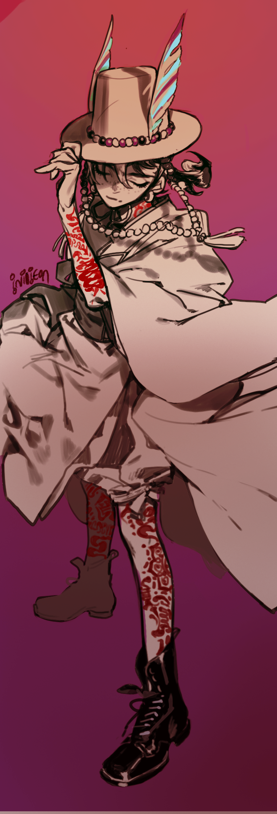{.circle .zoom25} | 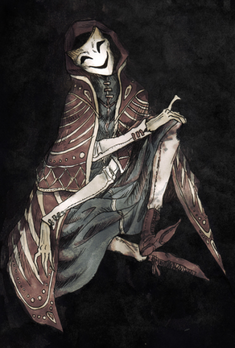{.circle .zoom} | 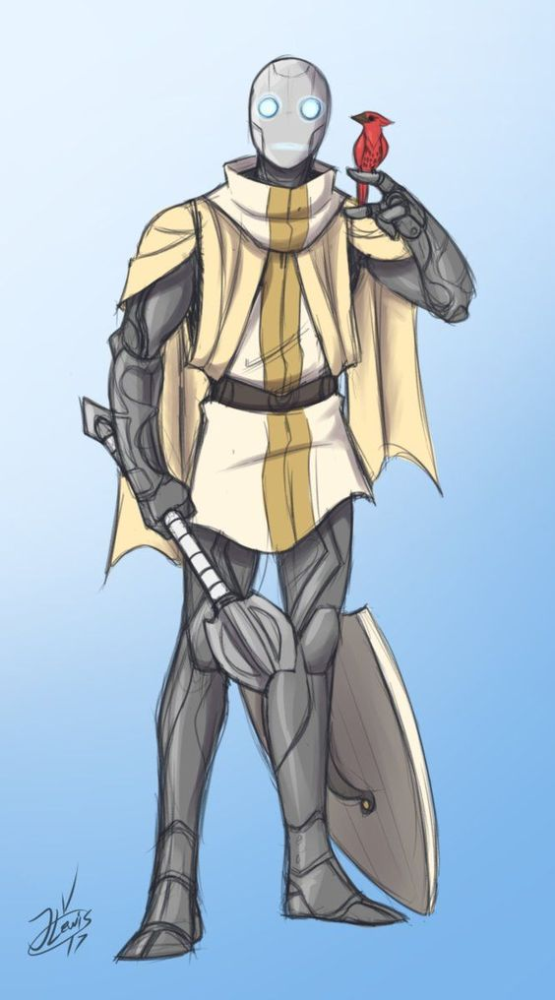{.circle .zoom25} | {.circle .zoom} | 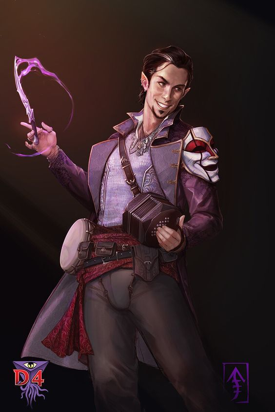{.circle .zoom} |
|                   Lupus                   |                  Barth                  |                  Carmen                   |                   Crypton                    |                  Slowpoke                  |

# Etharis {#etharis .tabset .tabset-fade .tabset-pills .old}

## The Dreamland Travelers {.tabset .tabset-fade .tabset-pills}

### Info

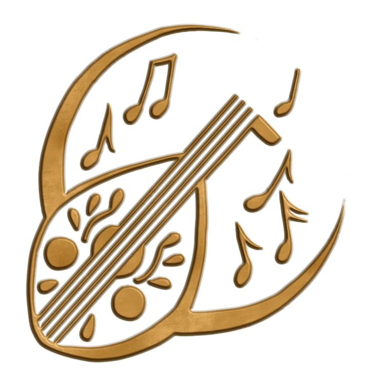{.halfSize width="50%"}

*"To entertain with talent and looks is great, but to entertain with ones soul; that is magnificent."*

**Headquarters:** None

Songs unsung, dances long forgotten and stories of man and monster none have ever laid their eyes upon; sure signs that the Dreamland Travelers are in town.
This rag-tag band of individuals travel the lands of Etharis to spread their arts for the delights of others; and earn a pretty penny in the process.

As all strangers are, they are treated with excessive amounts of distrust by most; more so by those of the higher classes.
To those who can't afford regular entertainment, however, they are a welcomed sight and make for a colorful evening of entertainment at the low price of a few coppers.

The troupe is comprised of people from all nationalities and (former) walks of life; outcasts, runaways, the odd ostracized or down-on-their luck noble; all find a home under the wings of freedom.
Those who find themselves a part of the troupe are inaugurated as family in a binding ritual that marks each of them as protected by the others: for the blood of the coven runs thicker than the water of the womb.
It is in this ritual that a new member sheds their last name in favor of becoming a Dreamlander.

At the head of the Dreamland family sits matriarch Tessilia, an older woman who hails from Charneault.
In her younger years, she and her friends joined a travelling caravan of merchants and used what skills as entertainers they had to get by.
As time passed, more souls joined them until they had enough carriages to form their own caravan.

### People

#### Friendly faces

##### Mantazi

Wise Dark elf, filled with dualities.

##### Oona

Sweet granny who loves to cook

##### Skra

Cute bird who is social

##### Ting

Cute bird who is speedy

##### Tarvik

Strongman who is intimidating but kindhearted

##### Tessila

Owner of the Dreamland travellers

##### Tripp

Reliable but antisocial scout

##### Valerian Alhambra

Magician who is mysterious

##### Troupe

## Ostoya {.tabset .tabset-fade .tabset-pills}

### The Stillborn forest {.tabset .tabset-fade .tabset-pills}

#### Overview

At times of famine, one more mouth to feed can spell the end for an entire family.
Giving birth to an illegitimate child, or gods forbid, the child of an outsider, could bring shame and accusation of familial betrayal or witchcraft to the parents of Ostoya.
Sadly, there are many reasons for a child to be abandoned, each more heartbreaking than the last.

The stillborn forest received its name as a result of this very practice.
Be it burying the corpse of an unwanted child or the improper burial of a stillborn infant, the stillborn forest is one that seems to be rife with decay, death and sadness.

##### Layout

The layout of the stillborn forest appears to shift constantly, making straying off the beaten path a dangerous affair.
The wildlife is abundant and full of diversity, consisting mostly of wild game such as deer, rabbit and pheasant, but animals such as wolves, bears and crows are an ever present factor of this ecosystem.

Many of the trees bear occult markings, both carved and painted, as well as being adorned by woven figures of twine and straw.
Most disturbing of all, perhaps, is the presence of single humanoid ears hanging from branches.
They come in all sizes and colours and seem to be made up equally of left and right ears.

##### The Lady

The forest is also rumoured to be the home to an ancient being - far older than humans, older than the stone academies and the mages, older even than dwarves and elves.
The folk who live in the forest have never seen her, but they know she protects them.
It would seem that this is the case, as Weeping Pox has not reached the lands of Lunsk and Fallowheart.

If one listens to tales and stories, you will learn how to plea for help from the lady; such help always comes at a price, but the lady has the reputation to always keep her word.
It is rumoured that the Lady helps those who are faint of heart out with unwanted offspring as well.
This is how one begs help from the Lady;

"Find a child, young and innocent, and search out the Lady's shrine---that is where the Trail of Treats begins. Set the child off on the trail and it shall follow its sweet track and find the Good Lady. The child will never want for anything ever again, for the Lady is kind and generous. Standing before her shrine, pronounce your request and the Good Lady will hear, for she sees and hears all that takes place in her demesne. If you made the offering as it must be done, your supplication will be heard."

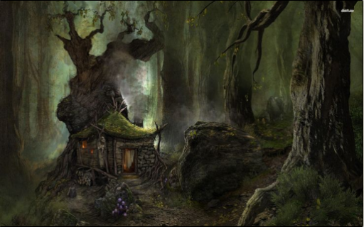

#### Lunsk

A small town, though one of the largest in the forest, walls fortified on the western side, the forest surrounding is thick with monsters and undeath.
They export lumber, namely **Sapwood**, found bordering lake Ostruva Mare.

The citizens distrust outsiders.


##### Town square

A beautifully kept garden lies in the town square, diligently kept by an old woman named **Theruoa**. 

The plants that grow here are varied, some are edible, some inedible, some poisonous. A deep rooted plant seems to be having trouble, sagging.

##### Tavern

The tavern is a large one, seeing action more in the eve, with some gambling taking place then. They serve a rare drink called Sapwood mead, which is sweet and syrup-y.

The barmaid is a wood elven woman, 

##### The Black Circle

The towns woodcutters are called the **Black Circle**, a lumberjack druidic circle.

They are recently making a new holy tree, a pale one surrounded by large white rocks, remarkably vibrant and alive.

The mayor suspects them of being hostile, currently no evidence.

They worship **the lady** giving wooden trinkets in her honor

The Druids wish to rid the land of undead with the use of a weirwood tree. They are not afraid of getting their hands dirty with killing off those who oppose them.

###### Weirwood tree. 

Sucks up magic from the environment, storing it at its roots. 
Over time its green leaves turn red and it sometimes grows a face.
The ground is extremely well maintained 

Sucks up necrotic energies, supposedly to reduce amount of undead in the area. This however would throw an unbalance into the beast/undead symmetry. 

##### Quests


- Look into a kid missing (maybe given to the lady?)

- Investigate woman's husband, who has been sneaking out at night. (probably cheating or doing necromancy)

- Look into kid whose imaginary friend might be real

- Cyclops north of town, hunt it down

###### Completed

- Investigate scratching under floorboards (probably rats?)
  - found cave under floor.
  - was full of [Kruthics(insect like monstrosity)](#bestiary) who were nesting there
  - Eliminated the nest and eggs
  - found blacksmiths neighbor dead


- wanted poster
  - The woman has been found, she was being hidden by the druids.

{.halfSizeLeft width=50%}


```{bash include = FALSE}
dot -Tpng ../Etharis/lunsk.gv -o ../Etharis/lunsk.png
```
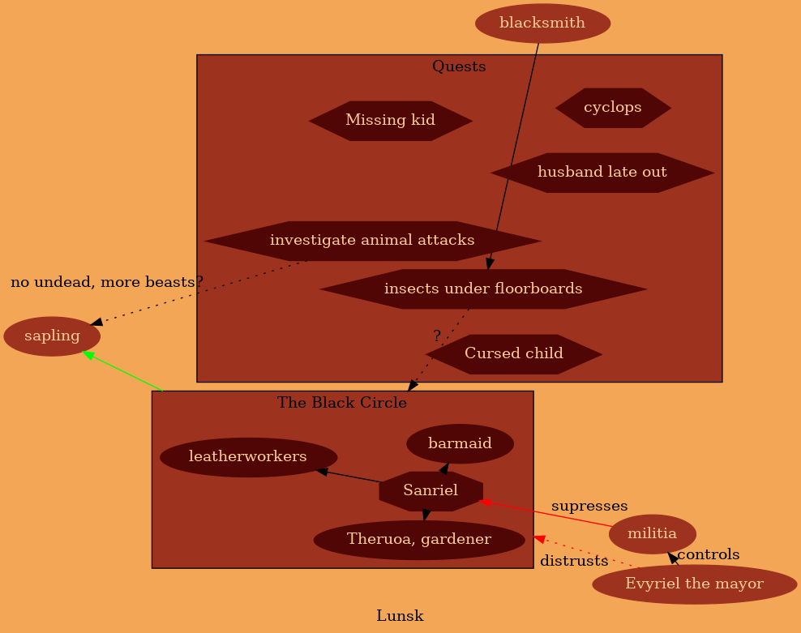

### The Black Myre

In the eastern portion of Ostoya, near the Dire Shore, a forest of aspens, willows, and oaks give way to fetid wetlands full of slow-moving, brackish water.

The Black Mire has not been thoroughly explored.
Most cartographers are forced to turn back due to the treacherous terrain, bad weather, illness, or swamp monsters that accost them as they travel.
Many an adventurer has met their end in the swamp's murky embrace.

Coincidentally, it is the home of the illusive Blackmire Lizardfolk.
Due to their nomadic lifestyle in such a hard-to-traverse terrain, their physiology and society is largely undocumented.

Stories persist that covens of hags dwell within the far reaches of the swamp, and that they are willing to make bargains with those who come searching for them.

One must beware when dealing with hags, however - often the payment they demand is something one is not willing to part with.

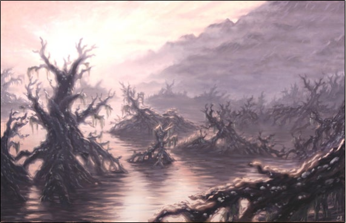

# Alin {.old .tabset .tabset-fade .tabset-pills}

## Bio

{.token .cropAlin}

### Data {.threeQuartersSize .book .textnormal .tabset .tabset-fade .tabset-pills}

#### Bio

| Info             |                                                  Description                                                   |
|:-----------------|:--------------------------------------------------------------------------------------------------------------:|
| Age              |                                                       19                                                       |
| Alignment        |                                                       CG                                                       |
| Pronouns         |                                                he/she/**they**                                                 |
| Heritage         | [Half Vistani](https://www.worldanvil.com/w/etharis-mikkow/a/half-vistani-article)(mother), half human(father) |
| Favorite Color   |                                                      Red                                                       |
| Languages spoken |                                     Common, old Ostoyan, Patterna, Druidic                                     |
| Tools            |                           Herbalists kit, Cook's utensils, Land Vehicles and Drums.                            |
| Birthplace       |                                                     Ostoya                                                     |

#### Stats

+-----------------------------+----------------------------------------------------------------------------------------------------------------------------------------+
| Info                        | Description                                                                                                                            |
+:============================+:=======================================================================================================================================+
| Strength                    | 8                                                                                                                                      |
+-----------------------------+----------------------------------------------------------------------------------------------------------------------------------------+
| Dexterity                   | 12                                                                                                                                     |
+-----------------------------+----------------------------------------------------------------------------------------------------------------------------------------+
| Constitution                | 10                                                                                                                                     |
+-----------------------------+----------------------------------------------------------------------------------------------------------------------------------------+
| Intelligence                | 6                                                                                                                                      |
+-----------------------------+----------------------------------------------------------------------------------------------------------------------------------------+
| Wisdom                      | 20                                                                                                                                     |
+-----------------------------+----------------------------------------------------------------------------------------------------------------------------------------+
| Charisma                    | 14                                                                                                                                     |
+-----------------------------+----------------------------------------------------------------------------------------------------------------------------------------+
| Dark powers                 | 10                                                                                                                                     |
+-----------------------------+----------------------------------------------------------------------------------------------------------------------------------------+
|                             |                                                                                                                                        |
+-----------------------------+----------------------------------------------------------------------------------------------------------------------------------------+
| Class                       | Druid (shepard)                                                                                                                             |
+-----------------------------+----------------------------------------------------------------------------------------------------------------------------------------+
| Level                       | 2                                                                                                                                      |
+-----------------------------+----------------------------------------------------------------------------------------------------------------------------------------+
| Background                  | Folk Hero                                                                                                                              |
+-----------------------------+----------------------------------------------------------------------------------------------------------------------------------------+
| Divination                  | If a job is worth doing, it is worth dying for: <br/>Increase your Wisdom or Constitution by 1. Reduce your Strength or Charisma by 1. |
+-----------------------------+----------------------------------------------------------------------------------------------------------------------------------------+

#### Backup 


+-----------------------------+----------------------------------------------------------------------------------------------------------------------------------------+
| Info                        | Description                                                                                                                            |
+:============================+:=======================================================================================================================================+
| Strength                    | 15                                                                                                                                     |
+-----------------------------+----------------------------------------------------------------------------------------------------------------------------------------+
| Dexterity                   | 15                                                                                                                                     |
+-----------------------------+----------------------------------------------------------------------------------------------------------------------------------------+
| Constitution                | 6                                                                                                                                     |
+-----------------------------+----------------------------------------------------------------------------------------------------------------------------------------+
| Intelligence                | 16                                                                                                                                      |
+-----------------------------+----------------------------------------------------------------------------------------------------------------------------------------+
| Wisdom                      | 13                                                                                                                                     |
+-----------------------------+----------------------------------------------------------------------------------------------------------------------------------------+
| Charisma                    | 16                                                                                                                                     |
+-----------------------------+----------------------------------------------------------------------------------------------------------------------------------------+
| Dark powers                 | 10                                                                                                                                     |
+-----------------------------+----------------------------------------------------------------------------------------------------------------------------------------+
|                             |                                                                                                                                        |
+-----------------------------+----------------------------------------------------------------------------------------------------------------------------------------+
| Class                       | -----                                                                                                                                  |
+-----------------------------+----------------------------------------------------------------------------------------------------------------------------------------+
| Level                       | 2                                                                                                                                      |
+-----------------------------+----------------------------------------------------------------------------------------------------------------------------------------+
| Background                  | ---------                                                                                                                              |
+-----------------------------+----------------------------------------------------------------------------------------------------------------------------------------+
| Divination                  | The wise learn from the deaths of others. Your Acrobatics and History skills each increase by 1. |
+-----------------------------+----------------------------------------------------------------------------------------------------------------------------------------+

## Memories {.justify}

### Birth and heritage {.tabset .tabset-pills .centered-text .halfSize .book .textlarge}

#### Mom

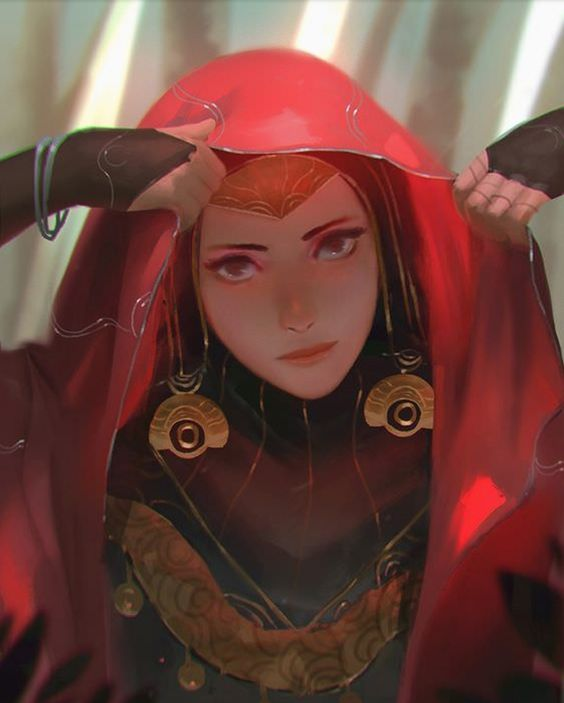{.circle}

Name: Isabela Tselikov

She taught me the importance of people, and through her i came to understand serving to bring joy to others brings peace to oneself.

------------------------------------------------------------------------

My mother has always been a servant, not of anyone in particular, but of a joyous life.
She brings happiness wherever she goes.
Compassionate, kind, and caring.
Her main job in the Tselikov band is as a dancer.
A spectacle of technique and flair, she flies across the stage in a perfected flow of flourishes of [blade](#vistani-blade-mesmerelda), twists and twirls, like a river or whirlpool.
Unmatched in the way she sways and swings across the stage.
Enticing you to lean in, as if this whole dance were for you.

#### Dad

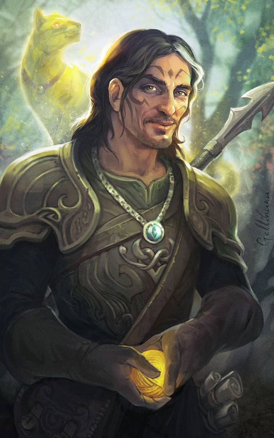{.circle}

Name: Ronan Byrne

My father, a druid who worked completely selflessly for life itself.
He taught me to strike balance and listen attentively both to people and to the world.
He showed me how connected the world is, and how it is just as much a part of me as I am of it.

#### Shae

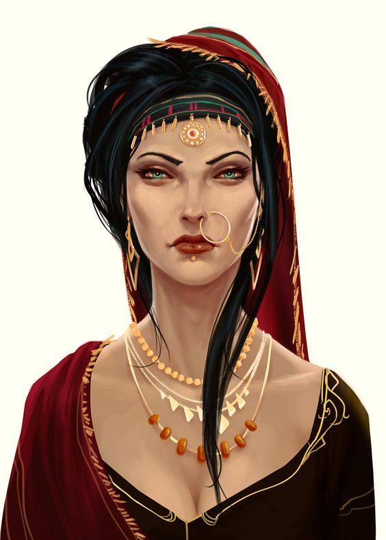{.circle}

Name: Katarina Tselikov

Honored elder, though distant from me.
She showed me [mercy](#arson-is-ill-advised-worst-memory) when times looked dark.
She is truly worthy of being [Shae](#vistani-lore)

### Prelude

### Early childhood

Born to a union between a Vistana dancer and druid.
Alin was not accepted into the midst of the vistani, though father almost a honorary vistani, someone with muddled blood would be allowed to stay if they don't prove to be a problem.

### Raised different

The children I played with when i was younger stopped, inviting me, or even including me in their games and circles.
As such i played with the animals, either with Ronan who taught me about them, or on my own, learning how they play.
I spent most days with the animals.
The other time, I spent with my parents, telling stories, playing games or merrymaking.
Sometimes dancing with my mother or hunting and gathering with my father.

### Stories neath the stars

During his life, Alin has had many nights filled with stories and wonder underneath the stars, some from his father, some from vistani when the whole tribe gathered.

#### The powers that be (Ronan)

"There are aspects of powers beyond us all around. From the flame that eats our wood and heats our winter nights, to the land that stays firm under feet yet gives way to roots and caverns. They all have something to say, if you but look close enough and learn to listen."

#### Preaching trees (Ronan)

"For me, trees have always been the most penetrating preachers. I revere them when they live in tribes and families, in forests and groves. And even more I revere them when they stand alone. They are like lonely persons. Not like hermits who have stolen away out of some weakness, but like great, solitary men, like composers. In their highest boughs the world rustles, their roots rest in infinity; but they do not lose themselves there, they struggle with all the force of their lives for one thing only: to fulfill themselves according to their own laws, to build up their own form, to represent themselves. Nothing is holier, nothing is more exemplary than a beautiful, strong tree. When a tree is cut down and reveals its naked death-wound to the sun, one can read its whole history in the luminous, inscribed disk of its trunk: in the rings of its years, its scars, all the struggle, all the suffering, all the sickness, all the happiness and prosperity stand truly written, the narrow years and the luxurious years, the attacks withstood, the storms endured. And every young farmboy knows that the hardest and noblest wood has the narrowest rings, that high on the mountains and in continuing danger the most indestructible, the strongest, the ideal trees grow.

Trees are sanctuaries.
Whoever knows how to speak to them, whoever knows how to listen to them, can learn the truth.
They do not preach learning and precepts, they preach, undeterred by particulars, the ancient law of life.

A tree says: A kernel is hidden in me, a spark, a thought, I am life from eternal life.
The attempt and the risk that the eternal mother Eana took with me is unique, unique the form and veins of my skin, unique the smallest play of leaves in my branches and the smallest scar on my bark.
I was made to form and reveal the eternal in my smallest special detail.

A tree says: My strength is trust.
I know nothing about my fathers, I know nothing about the thousand children that every year spring out of me.
I live out the secret of my seed to the very end, and I care for nothing else.
I trust that Eana is in me.
I trust that my labor is holy.
Out of this trust I live.

When we are stricken and cannot bear our lives any longer, then a tree has something to say to us: Be still!
Be still!
Look at me!
Life is not easy, life is not difficult.
Those are childish thoughts.
Let Eana speak within you, and your thoughts will grow silent.
You are anxious because your path leads away from mother and home.
But every step and every day lead you back again to the mother.
Home is neither here nor there.
Home is within you, or home is nowhere at all.

A longing to wander tears my heart when I hear trees rustling in the wind at evening.
If one listens to them silently for a long time, this longing reveals its kernel, its meaning.
It is not so much a matter of escaping from one's suffering, though it may seem to be so.
It is a longing for home, for a memory of the mother, for new metaphors for life.
It leads home.
Every path leads homeward, every step is birth, every step is death, every grave is mother.

So the tree rustles in the evening, when we stand uneasy before our own childish thoughts: Trees have long thoughts, long-breathing and restful, just as they have longer lives than ours.
They are wiser than we are, as long as we do not listen to them.
But when we have learned how to listen to trees, then the brevity and the quickness and the childlike hastiness of our thoughts achieve an incomparable joy.
Whoever has learned how to listen to trees no longer wants to be a tree.
He wants to be nothing except what he is.
That is home.
That is happiness."

### Famine (alin's first spell and focus)

There was a time where I saw strife.
It was when we were traveling deep in barren lands.
As winter struck crops would not yield and the very earth was left defeated.
We had long since emptied our stores of food and made use of our cattle.

Our celebrations became sparse, people rarely having the energy to spend on their way of life.
I saw the people I know become thin and pale, filled a constant gnawing in their body.
More than a handful were overtaken by illness as their bodies focused on conserving energy.

Ronan and I set off to find food as we had since food became sparse.
The lands, though unforgiving, still had some herbs whose poisons they could neutralize and old root vegetables still buried in the earth.
This would be enough, were there but a few people, but there were too many mouths to feed.
Ronan and i would return with the meager food they managed to secure and along with what others got, we would cook it and ration it to those that needed it most.

This would all change however on one excursion however.
As we were out gathering plants, something caught my eye.
A glint of green in a dying place.
Pushing past the dead things, entranced by life so radiant it was painful to look at after so long.
A powerful tree, standing firm and strong in the ground, with birds nesting and leaves bunched up in neat clumps.
I came to recognize this as mistletoe.
Stepping forth i placed my hand against it's trunk, gliding it against the rough bark.
As I admired the tree my hand moved along the wood, to a branch and then a clump of leaves.
As my fingers brushed through the sprigs of mistletoe I marveled in half prayer to the tree, of its strength and virility, of its sacred place among these woods, of the birds that found themselves sustained by it and the significance of such a thing.

I felt it, the bountiful life that flowed within, a warm solidarity that wished to share itself, not unlike the warmth of being loved unconditionally.
I knew it felt our strife as surely as I had felt it right now.
I pressed my forehead against the rough bark to thank it, and as i did so, i felt a shifting in my hand, now gently clasping one of the sprigs.
As i drew it away I found out why the tree had led me to it.
A gift of ten small berries and a sprig of mistletoe to which they are attached.

Once I returned to my father, I showed him what I found and told him of what I saw.
He merely wrapped his arms around me in an embrace more enthusiastic than looked fitting a man of his age.
"Alin, my child. This is remarkable, you have been chosen, seen worthy by the mistletoe tree. This is certainly only the beginning of your connection to the land. And what's more, you may have just saved us from starving. "

We returned post haste, and surprisingly enough, with a few pointers from Ronan, I was able to recreate what happened before, producing ten more berries.
Smiling proudly, dad and I added the berries to the pot.
It turns out, such berries are nourishing beyond belief, and with added ingredients gathered for structure and flavor, we were able to strive off the worst of the famine.

In the end, the time spent yearning for food, followed by being able to cook delicious meals, got me hooked on cooking.
Since that winter, I have continued cooking, though the famine is long past.
I find making good food can often brighten any day, and certainly those who are hungry.

### Tatoos

Alin's tattoos are more than meets the eye, the red twisting twirling and eye catching shapes are stories scrawled on their host in druidic.
Most would not even recognize them as script of any sort, the patterns more aesthetic and loosely structured than one would expect of writing.
They tell stories of old, they tell fairy tales of spirits and they tell lessons of the land.
Though written down, druidic is not a simple language, it is written in tongue which needs to be interpreted, parables and prose woven in one on Alin's skin.
They may read the same passage a thousand times and never repeat it in meaning, yet learning from it each time.
Such is the gift they were given by their father and guide, though he never revealed where he learned this pattern, or even how much of it he understood.

### Arson is ill advised (worst memory) {#arson-is-ill-advised-worst-memory}

When Alin was learning to understand the flames, tracing a particular story on the back of their hand, they found out how alive flame really is, responding to their guidance.
Mesmerized by the ebb and flow, they felt the hunger of the flame, to grow and eat, to be more of itself.
It the feeling felt like Alin's own and in a way it was, the boundary of the world and the edges of the separation getting hazy.
Alin was for a while swaying in tandem, a part of the flames, and without noticing they spread their arms and the flame was sated as the flame climbed up the tent.
The trance was only stopped with vistani stepping in and grabbing Alin.
The following was a tough time, as Alin was brought in-front of the elders of the band to stand trial for the seemingly deliberate arson.

The elders of the tribe consulted and asked Alin why she burnt down their family tent and started several more.
Alin, ever truthful told them, the hunger of the fire was overwhelming.
Even as the judged said this they knew the flame was not to blame, it was Alin who lost control, of themself and the flame.
The elders conulted once more and it seemed ever clearer that this youth was not to stay, not a vistana and not done anything special to earn a stay.
Alin listened to this with a sullen expression.
Resolving to accept any punishment without complaint.

But soon a voice spoke out from midst the others, the [Shae](#vistani-lore) Katarina Tselikov, one of the most respected vistana in the tribe.
She told the others that this was Ronan's child, and a gentle one, this was the first time any such thing had happened.
She was close to Ronan, him having saved her and several others many a time, this was only Alin's first offense.
And she managed to convince the others that if this was the only one, then Alin could stay, for now.

### The stench of death (folk hero event)

While we were camped in [*The Stillborn Forest*](#etharis), doing our standard rounds of merriment.
I became aware that something was not right, something smelt noxious.
The sickly sweet smell of rot and decay creeping in from somewhere.
Being covered by the sizzling food on the fire, we had not been camped here long enough for our wares to rot, so this stench was coming from elsewhere.

Closing my eyes, i focused on the smell, and the eyeless sight, A smell of rot familiar to the forest, but focused.
The foulness inching down my spine, with the scent of undeath nearby, a powerful, gut churning wrongness.
If it is this strong, then there's no time to waste.

**"Undead! Pack your things and move!"** I yelled, spotting shifting movement in the woods, large hulking and lumbering.
Tossing my bag on my back i pulled out three pebbles and prayed they strike true.
The mass emerging from the forest edge, i let loose one of the stones.
*Hit* I had its attention.
The others, fleeing hastily, retreated to the [*vardos*](#vistani-lore).
The stench got thicker as the thing emerged, thick vines like the thick roots of a white oak, drenched in green rot and housing several carcasses, with bulbs of flowers dotting the top like a mockery of nature.
Looking around to find a path clear of people, I saw the road ahead blocked, where people were gathered, trying to remove a tree that fell in the night.
I could not let this thing get there, where the only way out for us would be death.

A massive vine snapped out at a nearby cattle, nearly breaking it in half as it wrapped around the animal and drawing it into itself, the vines dragging it along the ground towards me.
It is slow.
I can use this.
I let loose another stone, speeding opposite of where the others fled to draw it away.
Another toss and i had its undivided attention.

My feet pulling me to the edge of camp, my wrist was grasped.
My dad, with a serious expression.
He told me to get to the others and out of here.
"The road is blocked, they cannot clear it. You're the only one who can." I said pulling my hand free and another 3 pebbles out of my bag.
"I can keep out of its reach and draw it away, it is slow." i stated, turning my head back to the creature now less than a stone-toss away once more.
Ronan grimaced as he looked past the creature at the mass of people.
"You better get back in once piece, I know you will." He said leaning in to give the side of my forehead a kiss.
"Meet us when you get clear of this thing." He said resolutely, trying to hide his fear, as his form shifted to that of an Ox, not the fastest beast but certainly strong enough to remove the blockage.

As my father cleared from the area i ran backwards towards the woods, hitting one of the bulbous flower-pods on the creature, it was still following me, good.
Turning to run to the back, I almost tripped on something shiny.
I recognized this sheen of blade, hilt red with flourishes.
Someone had dropped Mesmerelda, No-one was here to pass it to, and i certainly wasn't going to let it get left behind in the dirt, forgotten, so i grabbed it as i continued my assault.

It followed me into the woods, and for the next dozen of minutes i made certain to keep clear of its powerful vines, finally finding an opening to flee when i passed a patch of trees so close together it could not pass.

I looked for the road, I looked for my family, but ended up on a different path.
I never did find them again, but I'm certain I will one day.

### Vistani blade Mesmerelda {#vistani-blade-mesmerelda .linebook .halfSizeRight .cardOnHover .textsmaller .contentOnHover .justify}

"Long favored by street performers, this vistani blade was forged to dazzle audiences. A strip of bright red cloth has been wrapped around its hilt, winds through the back of its blade, and ends in little golden coins that dangle from it. These coins jingle and sway as the blade is swung, producing a sound similar to a coin purse being rattled.

Mesmerelda was originally carried by a troupe of traveling vistana but in the years since it has been passed from sword dancer to magician, and beyond, in its travels, during which time it has been an integral part of many daring exhibitions of finesse and skill.
Despite its storied history, the blade has never forgotten its roots among traveling folk."

#### Mesmerelda {.halfSize}

{.zoom width="50%"}

### A Dreamy encounter

## Personality

### Characteristics {.book .halfSize .centered-text}

#### Personal rules

"I would never hurt an another for my own gain."

"I will try to feed the starving however i can."

"I will aim to help people in being true to themselves"

"I will point out self deceptions wherever I may see them"

------------------------------------------------------------------------

#### Goals

##### Major

Listen to the old teachers of the world

Bring people joy

Help those who are struck by famine gain more food.

##### Minor

Learn to perform better

See all the strangeness of the world

Return Mesmerelda to the clan

------------------------------------------------------------------------

#### Personality trait

If someone is in trouble, I'm always ready to lend help.

The pain we share is equal one is not worth more than another.

#### Ideal

Respect.
People deserve to be treated with dignity and respect.
(Good)

#### Bond

I have a family, but I have no idea where they are.
One day, I hope to see them again.

My troupe is precious to me.

Hate is something I rarely feel.
It burns me as much as those it is aimed at.
\#\#\#\# Flaw

I have trouble keeping my true feelings hidden.
My sharp tongue lands me in trouble.

I will not stand by if i can stop an injustice.

I easily forget things like long names and complicated words.

### Answers to the questions

#### Physical description

Alin is of average height, black curly hair with ashen wisps.
They usually wear clothes similar to those of most Vistana, but what clearly separates him from them is the red tribalistic tattoos that cover their body from toe to Forearm.
To almost everyone these tattoos appear decorative and floral.
But to those versed in druidic these are stories, prairs and blessings.

#### Social class

Being born into a band of vistani, Alin has never experienced either lucrative luxuries, nor horrible poverty.
They have taken to viewing overindulgence as a sin and ignoring others suffering as a horrible thing to do.

#### Parents and family

Alin regards their father and mother as close family and confidants.

#### What sort of activities did you partake in, growing up?

Alin spent most of the free time in the day, helping Ronan forage and found a passion for cooking.
They didn't get to play much with the other kids, but was still able to participate in group music and dance.

In the evenings, The three told stories to each-other, either made up or experienced.
Isabela always knew what stories to tell when Alin was feeling under the weather, either from being bullied, or seeing the sorry state of the people they passed.

#### Do you have distant family in other regions?

The band and Alin's parents are still out there somewhere... hopefully.

#### Non-Familial relationships

The elders of the tribe rarely regard Alin, a good kid, but not one of them.
Alin's peers have cooled from their past of exuding Alin from everything, but they don't ask either.
Alin treats the animals that he gets close to as well as any people.

#### Did you have any pets growing up?

Alin Spent a lot of time with the horses and other animals that lived in the Band, crying whenever one of them died.
They liked playing with Ronan's familiar on the rare occasion that it was summoned.

#### What is your favourite memory?

Sitting on my fathers lap, playing the drums and singing while my mother was dancing on stage to our music, It felt like it lasted forever, though it lasted only the evening.
Laughs were had, songs were shared and it felt like all the problems of the world drifted into nothingness.

#### What is your worst memory? Who was involved in it?

When Alin messed up once, almost getting the others to throw them out of the band completely, luckily they had mercy and Alin was allowed to stay.

#### Your personality - Who is your character? What makes them tick? What are their core beliefs and how has the world shaped them into the person they are today?

Alin is an extremely empathetic individual, they are spurred forwards each day with the drive to see the world and all in it.
They are driven to help those who are suffering, especially those whose suffering is inflicted unfairly.
If only Alin could help them or at least offer comforts of food or change of mind.

#### Fears

-   Having to watch without being able to help when a loved one suffers
-   Undead, they are uncaring unfeeling and more horrible than the worst of beasts.
-   Being buried alive, or at all

#### Birthday

17th of Summertide

#### Where did you pick up the skills for the class you're starting as?

My father, Ronan, taught me all I know of druids, herbs and animals.
Though Alin always had a knack with animals, spending more time with them than other kids.

#### What is your view on religion and magic?

Religion:

-   Finding the strength to carry on for a better day is important, but not to demonize those you disagree with.

Magic:

-   Magic is to be used without selfish intentions, to bring balance, heal and protect.

## Relationships


```{bash include = FALSE}
dot -Tpng ../Etharis/alin_relationships.gv -o ../Etharis/alin_relationships.png
```


## Prairs and spells

### Spirit totems

- Bear:  
  - Ox: Beast of Burden, lend us your strength  
  - Bear: Beast of Bear, lend us your hide 
 
- Hawk:  
  - O' Hunter, O' Hawk, lend us your swiftness  
  - Raven of cunning, Lend us your wit.  

- Unicorn:  
  - Lord of the forests, give us aid  
  - Noblest of steed, your help we heed  
 
### Spells

Magic stone

- May you return to Eana, bring along their strength.

- May you strike with the might of a boulder 

- Heart of mine, strike out with blame. Take from me and earth in same.
 

Healing

- May you remember as you once were

- Your body is broken, but with your spirit I will mend it

- Bind the tears of flesh and bone: Leave the sick to health alone.
 

Entangle:

- Flora heed my call to you, grow from sapling, entwine here though.
 

Faerie fire

- O' spirits that are made on pyres, grow and show this place a fire.
 

Fog cloud

- Oh Crone and smith, doth heed my plea, mix in mist and let it be.
 

Goodberry

- Mother earth, a call of babe, grow and nurture, life do save.
 

Hold person

- You and I are one, you see. I hold my heart and you won't flee.


### Dreamland travellers

#### The Dreamland Troupe

# Bestiary {.old .tabset .tabset-fade .tabset-pills}

## Encountered {.threeQuartersSize .gridbook}

| Type          | Beasts | Undead | Monstrosities | Fiends | Fey | Abberations |
|:--------------|:------:|:------:|:-----------:|:------:|:---:|:-----------: |
| Type fought   |   0    |   1    |      2      |   0    |  0  |    0         |
| Number slain  |   0    |   0    |      7      |   0    |  0  |    0         |

## Beasts


## Undead

### Corpse flower

{.threeQuartersSize width="75%"}

Slow and lumbering, the stench of death fills the air.
Large and unsightly, they release undead from their bodies and hunt for living flesh.
The best course of action, to run.

## Monstrosities

### Giant boar
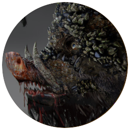{.threeQuartersSize width="75%"}

Charges, avoid being in an open area.

### Kruthik

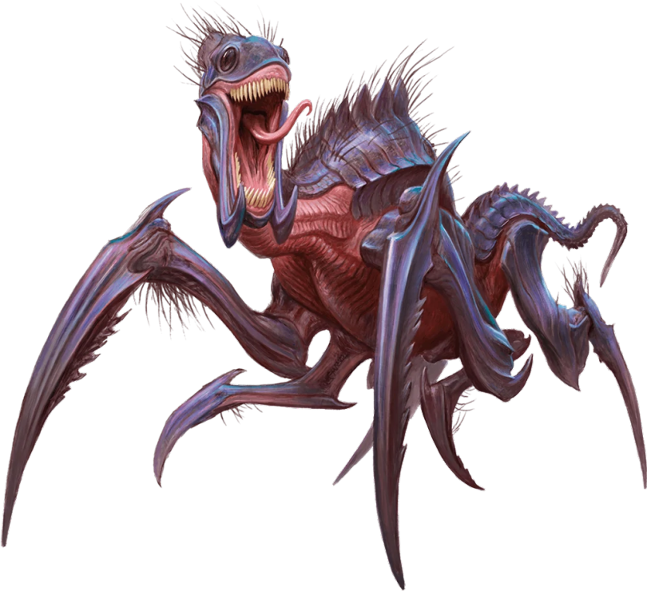{.threeQuartersSize width="75%"}

Fought 1 adult and 6 children

Kruthiks are a strange type of giant insect with sharp teeth and claws.Their carapice is thick and provides heavy protection. They are effective in groups and can dig through the solid rock.

They nest in large yellowy-greenish vine like structures in caverns, their eggs look like rocks upon the root-like things.

In combat, do not engage more than one at a time, try to kill small ones first, steer clear of cavern openings they could ambush you from.

# Bits of lore

## Countries {.tabset .tabset-pills .tabset-fade}

### the Valikan Clans

**Languages:** Imperial Norm, all dialects of Primordial, Giant, Orcish (Rare)

#### Thrull

#### Kandar

### the Bürach Empire

**Languages:** Imperial Norm, Lower-Bürach, High-Bürach, Raulish, Valikan

#### Altenheim

#### Nordenland

#### Rauland

#### Unterland

### the Ostoyan Empire

**Languages:** Imperial Norm, Ostoy

#### Soma

#### Raevo

### The Charneault Kingdom

**Languages:** Imperial Norm, Charneault, All Elvish Dialects, Sylvan

#### Tol-Leyemil, the Last Elven City.

### Castinellan Provinces

**Languages:** Imperial Norm, Castinellan, Draconic

#### Toletum

#### Faro

#### Therpena

## Deieties

### Entropic {.tabset .tabset-pills .tabset-fade}

#### Death

#### Frostelle

#### Night

#### Storm

### Harmonic {.tabset .tabset-pills .tabset-fade}

#### Blacksmith

#### Flora

#### Maker

#### World

## Druids


### Sacred Plants and Wood

A druid holds certain plants to be sacred, particularly alder, ash, birch, elder, hazel, holly, juniper, mistletoe, oak, rowan, willow, and yew.
Druids often use such plants as part of a spellcasting focus, incorporating lengths of oak or yew or sprigs of mistletoe.

Similarly, a druid uses such woods to make other objects, such as weapons and shields.
Yew is associated with death and rebirth, so weapon handles for scimitars or sickles might be fashioned from it.
Ash is associated with life and oak with strength.
These woods make excellent hafts or whole weapons, such as clubs or quarterstaves, as well as shields.
Alder is associated with air, and it might be used for thrown weapons, such as darts or javelins.

Druids from regions that lack the plants described here have chosen other plants to take on similar uses.
For instance, a druid of a desert region might value the yucca tree and cactus plants.

## Vistani lore {#vistani-lore}

-   Patterna - Vistani language
-   Giomorgo - A half Vistani\
-   Giorgio - Someone who is not Vistani. A general term for outsiders.\
-   Giogoto - An outsider who has done something so profound, they're basically honorary Vistani. They're accepted as one of the Vistani, though they weren't born one.\
-   Shae - a generic term for an honored elder.\
-   Raunie - A Vistana with an exceptional gift for seeing the Threads of Fate.\
-   Remanio - Vistana who has left their tribe\
-   Lunatio - or moon madness, irritable in the day. Frolicking at night
-   vardo - a horse-drawn wagon

## Witch Sight

While all creatures are connected to the weave, only those with strong magical abilities are capable of manipulating and reading it.
All people born with the talent to work magic have some degree of witchsight that can be developed and expanded with training so the spellcaster can actually see the ebb and flow of magic, witness the scintillating colors of the Weave's energy in its raw form, and be better able to harness it for the casting of spells.
Having the ability to sense magic enables magisters and their ilk to better control the energies they wield.
Aside from its utility, witchsight also reveals an abundance of odd manifestations, eerie phenomena, and sometimes glimpses of the future and the past.
Common applications can be, but are not limited to;

Detecting the present of otherworldly beings or other magic casters Detecting (unusual) magical phenomena such as areas where the flow of magic has been disrupted or otherwise changed.
Finding the exact location of a being, place or item that is channeling magic.
(Imagine a weaker detect magic) Finding a person whose signature you are familiar with within the range of your Witch Sight.
Your Witch Sight extends up to 10 times your Wisdom Modifier in feet (Minimum of 5 feet).
Unless you possess the Witch Hunter talent, your Witch Sight is limited to a feeling, rather than seeing something physical.
There are several DCs / tiers of gaining knowledge from a reading, increased or decreased by factors such as;

Attempting to use your Witch Sight through a wall or other obstruction The presence of other strong magic casters Lingering residues of magic casting Attempting to zero in on a particular strand of magic or person in a busy place Unless you enter a region that has a particularly strong magical presence or a thin membrane between the material world and the weave, you will not experience much from your Passive Witch sight.

# Session notes {.tabset .tabset-fade .old}

## 1

Mask: Priscilla Montegue

lunsk,

Small town, gated on the west.
Fortified town, the forest is thick with monsters and undead.
The citizens distrust outsiders.
They export lumber, namely Sapwood, found bordering lake Ostruva Mare.
The towns woodcutters are called the black circle, lumberjack druidic circle.

Seems like they all respect druids with many druids amoung the townspeople.

Rumors:

-   Vicious monsters and undead prowling the stillborn forest, many people have disappeared over the years.

-   Sapwood is said to have precious alchemical properties.

-   The leader of the black circle Sanrial is being kept from being elected by Evyriel using the militia.

-   Evyriel Lied to the local militia, the Torta.

-   The villagers practice necromantic rites.

Town square plants: Edible, inedible, poisonous.
Beautifully kept by an old woman who appreciates nature, Theruoa.

Deep rooted plant sagging more than others.

Tavern:

-   Sapwood mead, syrup-y

-   Wood elf druid bar maid

Quests:

-   Investigate woman's husband, sneaking out

-   Missing kid.

A gigant boar came in rushing after two guards, can it be persuaded to leave?

## 2 

Mask: Priscilla Montegue

Killed giant boar which turned out to be a monstrosity from the forest.

Evyriel is suspicious of druids since they don't have trouble in the forest

Evyriel angrily monologues to Sandriel about people in danger.

The tree pales in comparison to the new tree, i'm sure it'll be done in no time. 

Meek, the alchemist

* void coal (mastercraft venom clanse tea) 40gp

* artisans charcoal 1gp a bag

the floorboard scratching comes from a cave.

## 3


Mask: Priscilla Montegue; Masq(after being downed)

Abraxas was scared but performed bravely.


cave:

Jewlery: 30gp;

Carved out by some creature with sharp claws

long vine-y tree rooty tendrils, through the ceiling, with somewhat bulbous parts, eggs of Kruthiks.

Kruthiks, large insectoid creatures have made a nest and started tunneling behind the blacksmiths house.    

Big mama loot:

6 spikes (0.5 slot daggers)
Carapice armor (can be crafted into a medium[up to breastplate] or heavy [up to splint] that weigh half as much])

Druidic circle new holy tree:
pale colored sapling, surrounded by big white stones, 

Blonde lady at the middle, with people surrounded by the black circle (the wanted poster).

Druidic concept, ancestors of the land. Veneration of being born of the land and what it has given them.

## 4 

Masq: Priscilla 


Weirwood tree. 

Sucks up magic from the environment, storing it at its roots. 
Over time its green leaves turn red and it sometimes grows a face.
the ground is extremely well maintained 

Sanriel:
  the guard encroached on the boars territory, causing it to get enraged.
  
Evyriel:
  Things have recently gotten a lot worse, the forsest is unsafe.
  
Wanted poster:
  woman with blond hair hiding around with the druids.
  
something gold from the sky, a piece of paper, like fish scales, a ticket hits Alin's face
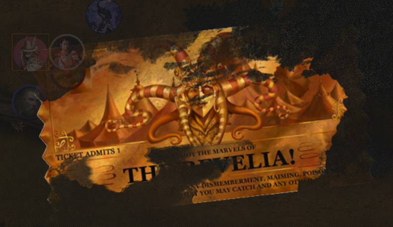

LEVEL UP!

## 5

Masq: Ella

Starts with performance

Many people came:

- Evyriel

- Meek and wife

- Theruoa

- Lesli

- Hodgepot

- Elf milf, Delilah 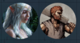{width=2cm}
  
  - Came alone from Nov Ostoya alone
  
  - Dissassociates a lot
  
  - Spellcaster of moderate power
  
- Human, creeping on the elf?


Pyke the demigryph, size of a mastiff. 

Competition of mallet rock, Hallbjorn won

Abraxas wooing elf woman, or other way around.

## 10

walking back from the troll debacle when the party noticed a few quails. Masq upon seeing them shot 3 in a single arrow.   
After which the party met up with a unicorn, who 'acted slightly sus'. After a while the Unicorn stared speaking with Alin, after they offered some stones to the unicorn, who later gave them a rock in return. He was not involved in things right now, not after his partner was killed.  
Lurking away because the unicorn is magic, Halbjorn saw a centaur kidnapping a woman, and of course he decided to tackle the centaur... and did... Successfully. Turns out the centaur was 'courting' the woman by kidnapping her, as per centaur culture... also the woman was a dryad, so there's that. A long argument ensued, with the centaur running away, he was too fast and got away.

## 11

Getting back into town, the party went directly to Evyriel, she was surprised. Especially about the husband being dead, as she'd seen him alive recently. So the party was sent to investigate, not many clues but there were dragmarks and dirt. Mazati flirting with constantine. Abraxas saw shady looking people going northwars (with dragmarks following). turns out they were sheltering the criminal on the wanted posters. the party splits, some investigate druids other go to the torta. 
In comes Mazati, dropping the party constantine, a tiefling who likes breakng into places.

## 12

The party lied to the militia about what the druids did (also some truth), they were taken in. The party went into their house, found a long cave, blood splatter and followed it. They crossed a river, Hallbjorn fell and got hurt. They climbed out and found themselves out of town. Hallbjorn found tracks, they went east to an intersection. They found a giant ass treant. Turns out it was but an illusion.
Hallbjorn hit a cat who ran away. They found a witch's shack with a track that appeared well used. Everyone heard a heartbeat. As soon as they stepped on the bridge the pounding got harder, then he burst out of the water.

## 13

Alin went with tripp to find the dreamlanders.

We killed the fiend and gained a telltale heart, mazati was worried but we got back ok. They get some rest.

Next stop: Graffendam

## 14

some fun rp, 

Masq gets Tarvik's clothes, alin heals her.
She talks about their powers with Unit while Alin and Constantine hunt squirrels with Puppi.

Sapwood golem in the forest.
vision
Middle aged wizard making it with a metal wand, when he died of old age he is crosses to here

Unit grabs his hand, somehow initializing a system update, after a while (with constantine trying to go back) the wooden golem is updated and now sentient. It chooses "unknown" as his name and gets greeted by unit and alin.
Scratching inside of unit.

## 15

Unit and Alin try to convince Mazati to adopt Unknown.
It goes semi ok, he will think about it.

Masq takes Alin to go to the city to look for a cart (for Unknown), She looks like a large burly man (in Tarvik's clothing). She also invites Constantine, to pay for his drink. Masq asks Alin which animal they'll transform into, Alin settles on an ox. 

Abraxas woke up, very exhausted in dahlias arms, he overslept a long time.

Hallbjorn wishes to rest in bed but wakes as Oona looms above. "Oho did you think you could rest? We have things to do." She says, sending him to hunt for meat. Though missing at first, he manages to land a shot in an elk.


A vote is going on about weather to disband the torta "There's something bad going on here, people keep disappearing, not all reports reach my desk. I think we have more than just the outside to fear." The people seem nervous, Masq listens in. Constantine breaks into a house and steals booze. Alin eats plants and waits by the gate.

Masq buys some cake. Decides to follow a woodcarver old man that stormed off. Alin (now humie) followed the tracks to his house. He's grumpy and has a wagon that costs 30gp.

## 16


