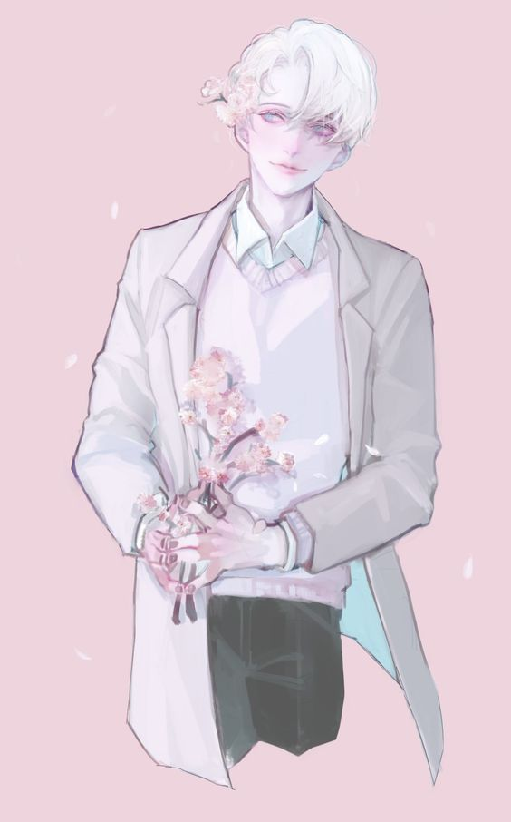
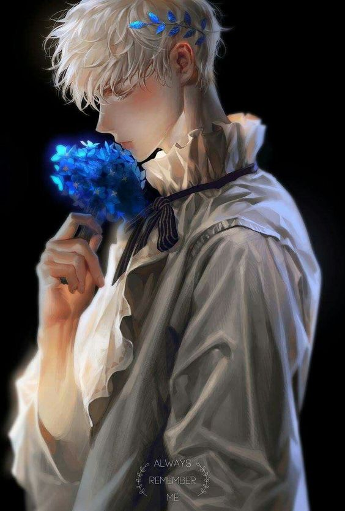
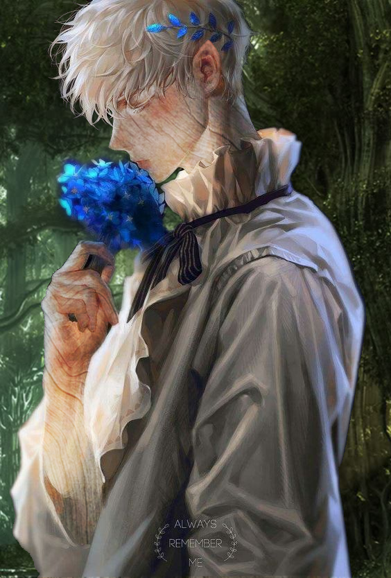
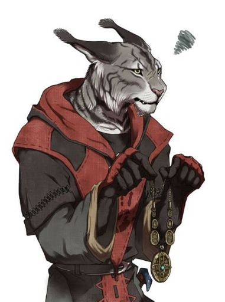

|Contacts||
--------|-
|Discord|Lupus#1170|  
## What is dnd to me  {.tabset .tabset-fade .tabset-pills } 
Dungeons and Dragons is a tabletop roleplaying game.  

### Characters per class 

|Number of characters | Class|
|:------------:|:----------|
|1            | Artificer|
|2            | Barbarian|
|4            | Bard|
|0            | Cleric|
|2            | Druid|
|1            | Fighter|
|1            | Monk|
|0            | Paladin|
|1            | Ranger|
|4            | Rogue|
|4            | Sorcerer|
|2            | Warlock|
|2            | Wizard|

### Reasons for this amount of games
* dnd
  + starts on Fridays
  + no babysitting
  + fun with friends
  

  
# My previous characters {.tabset .tabset-fade .tabset-pills .old}
Through my years of dnd experience i have made many many characters, some of which I love dearly like a friend.  
Here are some examples:  
`Disclaimer, I am not the creator of any of these artworks`

## Aculeus Floreo {.tabset .tabset-fade .tabset-pills }
Devout follower of the Wildmother, a student of Druids from the circle of Dreams and someone with hidden powers drawn forth upon entering the misty lands of Barovia.

### Follower of the Wildmother 

### After awakening 

### Blessed by the fane

## Lohe {.tabset .tabset-fade .tabset-pills .character}
A draconic sorcerer and painter  

### Cats dragons and a quest
in his childhood

### Monstrosities and new friends
Magdala

### Death and Dragons
Died to dragons  

## Nox Kieron {.tabset .tabset-fade .tabset-pills .character}
Necromancer wizard with a lust for knowledge and indulgences.

### Young Nox
Shortly after being thrown out of the **Sygaxian college** of magic for reading forbidden tomes. Nox Started to learn on his own and find what he could to combat the ancient evils of this world.  

### Aged
After joining **The Elements of surprise**, they ventured into a past dwarven keep called **Khundrukar** to reclaim it from the orcs and undead. Victorious, but not battle scars, Nox was magically aged 30 years through an encounter with a ghost.   

### Ready for ruling
After meeting the Saint of knowledge **Syxax** Nox went forward with new found information and determination, to become a great wizard and finish his very own mage tower in the keep of **Khundrukar**.  

  

