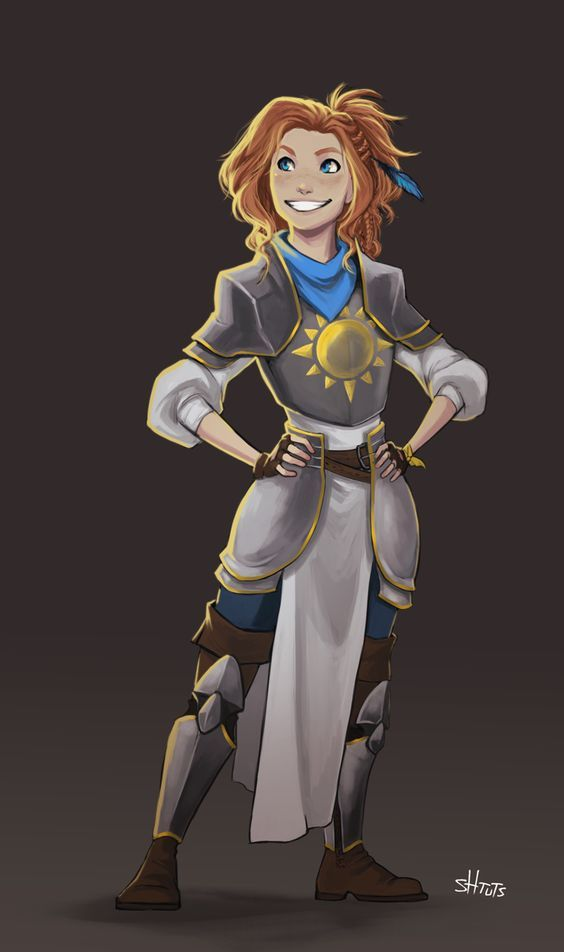
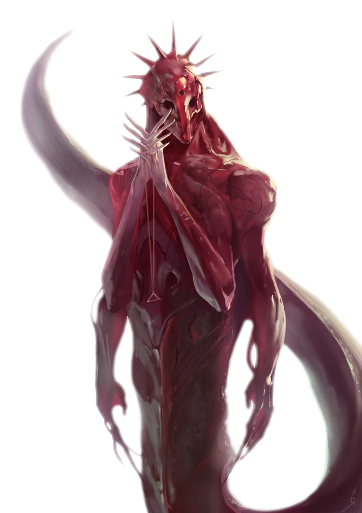

# Players and characters 


Lupus | Amber | Farris |  BlackSpirit | **WhiteBones** | Gabe
:--:|:--:|:--:|:--:|:--:|:--:
<image src="../Hugal/lulu_token.png" class="zoom circle" style=" width:10em; height:10em"> | <image src="../Hugal/Alistina.png"class="zoom circle" style=" width:10em; height:10em"> | <image src="../Hugal/Ulgrimm.png" class="zoom circle" style=" width:10em; height:10em"> | <image src="../Hugal/Trent.png" class="zoom circle" style=" width:10em; height:10em"> | <image src="../Hugal/Winnigar.png" class="zoom circle" style=" width:10em; height:10em"> | <image src="../Hugal/Alistair.png" class="zoom circle" style=" width:10em; height:10em"> 

# World {.old .tabset .tabset-fade .tabset-pills}


# Characters {.tabset .tabset-fade .tabset-pills .old }
## Lulu the Hollyohant {.tabset .tabset-pills}


<image src="../Hugal/lulu_token.png" class="threeQuartersSize">

### Personality

#### Traits {.threeQuartersSize .book .centered-text}

Nothing can shake my optimistic attitude.

Curious

Dreamy

Impulsive

***

Peace and Prosperity 
Greater Good. My gifts are meant to be shared with all, not used for my own benefit. (Good)

***

I would do what I could to help People be ok

***

I would trust my friends enough to follow them off a cliff

Actions speak louder than words

 
### Backstory

After being rescued from devils by the Kaelian mage Sylvira Savikas. Sylvira took it upon herself to recovery Lulu's memories while searching for a means to unlock a puzzlebox that came into her possession. A venture that has taken them from Kaelia to Port Solyma and if they weren't interrupted they would have gone to Euriel afterward. How Lulu might communicate this information to the rest of the party:

“I don’t remember…” “I don’t remember…” “I’m sorry, I don’t remember, Sylvira says something broke my head and it makes everything really confusing…” sad toot
“I came here, to Port Solyma with my friend Sylvira Savikas. She rescued me from a really mean ice devil.”
“Sylvira is really nice lady with pretty red skin and nice horns and a cute tail that she doesn’t like to show off. Oh! And she’s also a very good mage with a talking head for a spellbook.” Lulu nods wisely with a happy toot at the memory.
“Sylvira was helping me recover my memories and looking for a way to open a puzzlebox she has, so we came to Mercia from her tower in Kaelia and…” Lulu stops talking and looks down sadly
“Umm, ye… We followed them down into the catacombs and then and then they attacked us. They hurt Sylvira and she told me to run an-and I ran and ran and I got lost in the tunnels until I found another way out and there was a shrine and it was so green and then they saw me when I came out the ground and chase me and then I found you.” The little elephant-like creatures pace around in circles and collapse around themselves like a ball of golden fur

Lulu only has a few fragmentary memories of the time before her amnesia:

- Flying over a vast, dark ocean. The water reflecting a sky filled with diamond-like stars. In the black depths below, a huge whale seemingly made from golden motes of light swims through the darkness.
- Looking out a window made from gems set into silver and gold, across a verdant landscape where metallic dragons flit through the sky.
- The smiling face of a blindfolded golden-haired woman with ivory wings. A friend she doesn't remember.
- Flying over a boundless expanse of black, cracked basalt. A single-file line of strange, polyhedral-shaped creatures marches below, stretching from horizon to horizon.
- A busy marketplace carved from a cliff-face. She was speaking to a winged lion with the kind-yet-stern face of a man.
- Marching with an army of knights through a desolate wasteland against an army of monsters.
- Sometimes this feels like a magician’s trick: She remembers riding through a crimson portal, seeing a blasted plain stretched out in front of her, and then… Everyone is gone and she’s all alone.
- A silver beach beneath a pair of blue moons. Sometimes she remembers her warrior angel being with her there.
- The taste of blood and fur in her mouth.


## Naela Backbreaker Karkolduhr

<image src="../Hugal/Naela-token.png" >

### TLDR {.threeQuartersSize .book}

- [Birth](#birth)
  - A goliath born and raised in the clan house along with the other children
- [Young Achiever](#young-achiever)
  - She showed great promise in combat. 
  - Due to her preferred style of fighting she has many scars.
- [Loss of Grace](#loss-of-grace)
  - Became too arrogant
  - Lost consciousness in a hunting trip and was only barely able to be saved by the others.
  - A back injury left her crippled.
  - Due to her injury being caused by arrogance she earned the title **Backbreaker**.  
- [Healing](#healing)
  - Due to previous achievements she was not deserted once found out to be crippled
  - Despair from being crippled
  - Through strenuous effort and a long time, Naela walked again, poorly.
- [The Smith, Korel Brightsoul](#the-smith)
  - There is only one goliath who was crippled yet is still respected.
  - Wraught by nerves and a poorly acting body Naela makes her way into the smith's mountain chamber.
- [Consulting the elder](#consulting-the-elder)
  - Naela asks for aid in regaining her competence.
  - Korel decides to help her.
- [A slab](#a-slab)
  - Korel Hands her a sword fit for a giant.
  - He tells her to not try and stand but stand tall pushing her strength.
  - At first distraught she resolves to follow his guidence.
  - She trains to lift the sword, at first moving around with it dragging around.
  - She eventually is able to lift it, the strenuous activity restoring her controll and strength day by day
  - Once she is able to swing it around, she starts sparring with Korel. The damage to her back still proving fatal with pangs of pain and temporary losses of motor function.
- [A suit](#a-suit)
  - Korel tells Naela of a way to realign her back it would however be unimaginably painful
  - Naela accepts the offer
  - Korel proceeds to spend time forging an apparatus that would attach to her back and realign it over time with force.
  - The process begins, Naela is placed on a stone slab. The attaching of the device is painful but the slow process of realigning her back even more so.
  - To protect her back from further damage, because of her still weak back.
  - The training continues with Naela eventually feeling at one with the armor. 
- [A surprise](#a-surprise)
  - Through the tough moons of training Naela has started assisting Korel with his work as smith.
  - She has proven a reliable helper, impressing him with her unyielding spirit and drive.
  - Korel decides to impart the wisdom of the runes onto her. 
  - A ritual ensues witch floods her mind with information she cannot clasp.
  - She feels a knowledge from high above, Korel later calling him the god of giants.
- [Facing Fears](#facing-fear)
  - Naela learns to utilize the strength of the giants.
  - She sets forth to take down the beast that broke her.
  - She tracks it down and ends it.
  - She takes it back to the clan to show she's back.
- [The Backbreaker](#the-backbreaker)
  - What followed is a rejoicing and prosperous time.
  - Naela rejoins the clan and hunts
  - She proves to be grown in both judgment and strength.
  - Working with the smith Naela helps improve the clan's prosperity noticeably.
  - As honors for her grueling effort in regaining her strength and control of her body the chief awards her with a tattoo. A tattoo of entwining beams of metal, showing her flexible yet unbreakable will.
- [A noble goal](#a-noble-goal)
  - Once the clan was contacted about the Dwarven plan of elevating a few among the clan into nobility. Naela was one of the natural picks.
  - Though hesitant, she agreed to the idea because of the possibility of elevating the clan's status.
  - Due to the inclusion of goliaths in the Karkolduhr clan being controversial there were many that were opposed to Naela being appointed as a knight.
- [Mercian Magics](#mercian-magics)
  - In order to undermine the choice of those that would include the goliaths. Naela was given a mission that would be seen as nigh impossible for her, she was sent on a diplomatic mission to Mercia.
  

  
### Birth

Her fist scream echoed in a smoke tinted log hut, the warm embrace of her birth mother shielding her from the rigid mountain air outside. Naela was quickly placed with the other small goliaths in the clan house. There she took her first steps and grew her first 5 ft. 

Her days were spent playing with the other kids and learning to survive in the mountains. She grew to be a fiesty kid, excelling at most things phisycal. As she play fought the other kids she found it easier to throw fists and tackle her competition, eventually even those much older than her. This made her cetrain in her strength. Overly certain. 

### Young achiever

When she grew to be but a few feet short of the adults, she was included in the hunting and gathering trips. As the trips grew in number, her prowess was clear. As was her weakness. She was great at getting in close, tackling the enemy and hitting it where it hurt. But she herself was exposed, her leather straps of armor offering little protection of the immobility of grappling and the countless scratches and scars that ensued.

### Loss of grace

So it happened that she was once overpowered on a hunting trip, they were taken by surprise by a huge polar bear descending on them. Naela tried as usual to fight and grapple the creature but it was merely too large, It slashed open her back and only from the combined efforts of everyone did they make it flee. Naela was dragged back to be healed, her name disgraced, her back heavily wounded. She was reluctantly taken care of because of her previous accomplishments, but she found herself barely in control of her bodily faculties. Such people have no place in goliath society, cripples would only drag the rest down. 

Thus she earned the nickname 

> Backbreaker

### Healing

She dreaded this outcome, and though despairing, she would not let herself fall this easily. Finding her limbs not listening to her commands, Naela panicked. But through persistence and resolve she moved her weighty bones. First unable to stand on shaky legs, in time was even able to lumber around on them. But she feared being like this forever, so she decided to seek aid. To consult the only goliath who was able to not only be crippled and still able to stay in the clan but also respected.

### The Smith
Naela struggled outside the stone doors of the smithy. The frigid mountain air stinging her resolve. This is what she needed to face, the great Korel Brightsoul. A man who would most certainly have become the clan chief, had he not fallen to his tragic fate. Indeed, even now his name was still revered still among the goliaths. Her legs wobbled as she planted them in the snow, forcing herself to stay upright by laying a hand midway on the gigantic slabs of stone. This was the man. The one goliath whom they still respected, even after losing his arm and leg to a monster. Or so the story went. The stone felt warm to the touch, behind them lay a way forwards. Maybe even a way back to her former vigor before the injury. This man would know how. If anyone did.

Taking a deep and icy breath she leaned forwards with strenuous effort, her muscles were not what they used to be. Even if they were, they'd hardly obey her will after what happened. With her weight against the door, she finally gave it an impact with her shoulder, knocking the door ajar. With a loud creaking sound and hot pain searing up and down her shoulder, she was welcomed with the hot and metallic air that washed her over.  She gritted her teeth.

Stumbling inside and adjusting to the light, Naela's eyes were caught by glints of shining polished metal. "Hello?" She called out, taking in the numerous weapons, shields, armors, and other gear dangling from the high walls. Her plea echoed back a moment in this large chamber. Realizing she'd already called out, she straightened her back as much as she could and added "I seek your counsil". 

With baited breath she waited, until a rhythmic clang echoed from within a hall, a deep and resonant thud getting louder. Silhouetted by a gentle red from what Naela assumed to be forge light, a hulking figure approaches the noise, large even by goliath standards. As the figure approached, it's outline became more apparent. A thin metallic pole where it's leg once was, and the outline of an enormous hammer swayed instead of one of his hands. "Speak" echoed a deeply powerful voice quietly yet firmly. She would have to convince him to teach her. Teach her whatever she needed to know to reclaim her former glory as a goliath as well as her respect for herself.

### Consulting the elder

Her head, inevitably drawn down in humility, bowed. Her eyes failed to avoid looking at the prosthetic leg of the elder. "I seek- I ask for your council, Brightsoul." Her eyes trailed back up, the man now close enough to see clearly. Skin covered by a few pelts, he was dressed loosely, adorning his wounds and scars without shame. With an attentive gaze Korel studied the mixed expression of certainty, fear and quiet passion in her face. Leaning closer, he was soon looming over Naela. The little confidence she still had quickly fading into uncertain panic as she felt surrounded. What was he going to do? She felt smaller than she'd ever felt, feeling the lingering heat of the forge radiate from his warmth. A heavy slide and thud as the stone door behind her slid back into place. "Follow." He said, turning around to go back towards where he came, a sly smile of amusement barely noticeable on his face. Though his steps were slow, they were large and quickly starting to get further away. Naela struggled to her feet, regaining her senses, her hands and feet felt awkward as she tried to move faster than she had in months, struggling to place her feet in a way that wouldn't make her fall.

#### A slab

A bright furnace held the chamber at an uncomfortable heat, the smithing room. 

#### A suit

#### A surprise

### Facing fears

### The Backbreaker

### A noble goal

### Mercian magics

# Notes {.tabset .tabset-fade .tabset-pills }

## flashbacks

### a

Ariel riding atop Lulu, her war elephant, were on a green grass, in front of us is a similar fleshy growth "hell portal'. 
Zariel calls out to someone to into the portal, Lulu felt she couldn't look away from it almost in a trance. 
Zariel shouts mentioning a name Lulu could not recall, "...he has taken one of our own! charge into the portal and him him back!" 
we all charge into the portal... memory ends.

### b

A Demonic knight of Palor called her name for a boon

### C

Zariel's testifying... she's screaming... someone's on trial... "your betrayal, Ashmendale, will cost!... i will speak my truth!"

## Gideons testement {.book}

> The overwhelming theme of the book regards the evils of demons:

The Woman: Tell me, O Master, of what is the greatest evil.  
Gideon: It is that of the Abyss. It is the teemless horde of chaos which seeks to rip down civilization.  
The Woman: And why should civilization be not destroyed?  
Gideon: Civilization is that which gives life meaning. It is the font of morality and thought. Of art and of science.

> Great praises are heaped upon those divinities which stand stalwart against this demonic threat:

It is the gods’ place to stand between Man and Chaos. It is their aegis which is their ultimate purpose, for behind their shield we create greatness and dedicate it to their honor.

> One night, however, Gideon awakens from a strange and formless dream and sees a disturbing vision in his bedchamber:

There I beheld her. Her beauty was so great it seemed to burn my eyes. And yet through my blindness I could see her with greater clarity than any other sight that I have ever beheld.  
Two great wings of white she had. And a sword of celestial steel so sharp that I could hear the hum of its edge. A weapon made to cleave the division between soul and mind.  
But then I saw this essence of perfection cast away her sword. Her wings turned black. Her eyes turned to pits of fire. And a great and terrible purpose furrowed her brow.

> The next day he speaks with the Woman in White, who tells him that she, too, has had a vision of this angelic being, and that its name is Zariel.

Gideon: But why should she have turned from the light?  
The Woman: She turned from the light because it blinded her.  
Gideon: Does not the light let us see?  
The Woman: That is the lie of the light. We think only of what it illuminates, but not of what it conceals from us.

> Gideon realizes that the Great Blindness – the Great Lie — is that the gods protect man from chaos:

… but it is not so! Pelor? Selune? Bahamut? Kord? His children? None of them battle the Abyss. They claim the glory of that war, but shed no blood in it!  
This is why Zariel turned from Heaven. She saw the truth of her holy purpose; the Great Need to stand against Chaos. And she saw that her “holy” power was powerless because her gods had willed it so. Thus she allied herself with Hell! For it is Hell who fights chaos! It is Hell which sacrifices itself in the Blood War! Hell which fights eternal so that we poor mortals may eke out a few years of freedom upon the mortal plane!

> Zariel is, thus, the inordinate exemplar of both sacrifice and surface. Gideon has nothing but praise for her, for the choice she made, and for the great work which she does in the service not only of the mortal races, but for the balance of the entire multiverse.

Without her, all would become Chaos. And all those who do not stand with her are servants and abettors of Chaos, though they know it not.

## Session notes {.tabset .tabset-fade .tabset-pills}

```{bash include = FALSE}
dot -Tpng ../Hugal/Avernus.gv -o ../Hugal/Avernus.png
```
<image src="../Hugal/Avernus.png">

### 1st back

City- Euriel

Gideon- plans to make army of undead to free euriel. Forgot who Pelor was.

devil- the philosopher, winged on the house. 
ah, they institutionized a religious subversion, instead of venerating gods, venerating a religious idol.

Mage tower, overrun by hell knights

Curriors tower/guild
filled with dead people

basement lvl 1

Doors, light, organic matter and rubble
singular head with a helmet on the floor

something moving in the back

vent -> boiler room -> spherical pods on the wall from a strange and horrid fiend. One which ripped countless people into shreds onto the walls.

Noelle, Alistair's sister, crippled from the lower body but managed to survive.


### 2nd back

We go towards High Hall.

Noelle disgruntled rides on the white sun

Her majesty's peacekeepers, carrying barrels of water and food.

Dracanoid individual, white in color. NE -> SW


in helm

angel with red eyes

tall devil in black and gold, two long dark horns, he reaches over to her, "where is her sword?"


we are all uniformed in a knights garb,
woman with dark hair, bearded man, the angel riding a mammoth (lulu)    

Haruman, Lord Knight of the Far Hills greets Lord Olanthius
lady yale of Idyllglen

avernus (battle in distance)
Zariel kneeling in the dust, Yale as well

Zariel is pushing her sword to Yale's hand. "I refuse, do not ask me of this" Zariel: "I must, please do look beyond this forsaken day, dream a little bigger." With a trumpet, lulu comes Charging forth, "I've driven them off fora little bit" "Lulu my dear friend protect yale and don't let her sword fall. We may never meet again, but i hope we do. This is the last thing I will ever ask of you. Protect yale"

Vision clears, "riding on full horseback towards battle." ahead of  us on a golden mammoth, Zariel. (mostly human knights against knolls)

12 ft gnoll leaps through a portal with lady yale in her hand.


"Where is the sword"

"I dont know... I... I.. Used to know but i don't any more... I don't... I don't..."

An immense circular light overtakes the portal, a soothing light shilluetteing a figure. It's deep voice booming "To Lulu ye Zariels blade, it's key to her heart and what she desires. Even from my sight is the sword hidden, the only one who knows knows not. She must seek the kenku, in her memory they speak. Seek the kenku!"

Mr Bennersby  was making a deal with an imp
casted suggestion to make the imp tell the halfling of his evil plans for his soul and his families.
Mr Bennersby joined our safe house.

#### Creed Resolute. 

The founding document for the Order of the Companion of which each knight carries an abridged version. The full Creed is actually a lengthy document proscribing and prescribing various courses of action that are “right and proper” for a knight. This includes some guidance that’s ethical and moral (chivalric code), as well as other guidance that’s more practical such as codes of dress and the list of arms and armour which any follower of the Creed must maintain. Also contained within is the oath the knights swear to uphold the Creed:
I solemnly pledge my soul and blood and blade to serve as a knight of Euriel and share the Oath of the High Observer in honouring the Gift of the Companion. I shall guard the realm of Mercia and all those lands which lie under Euriel’s Shield, upholding the laws of Mercia and the commands of the High Observer. I shall live my life in strict accord to the Creed Resolute, placing it and this oath above all other doctrines. I shall be bound to all others who swear this oath, declaring them now and forevermore, whether in life or beyond the veil of death, to be my brothers in arms. To ensure the perfect harmony of our brotherhood, I shall permit no difference in faith to come between us, but rather hold the Companion, which I shall never attribute to one god or another, as our common star.

### 3

We set off to look for kenkus.

Magnar used to have a kenku friend.

We decended with a rope down a cliff, engraved:
night of the red coup 1291 af

We see a man running from 3 goatlike devils, 
after saving him, we make his aqaintance.

> Orin Ragron, a blacksmith of Euriel. 


5 hell knights on  bahamut blessed (trapped) bridge
2 with wings
1 large 
2 normal

Master of cruelties (his liege Arthur) knows Alistair. A high knight.

After many difficulties we killed them and had a rest.
Lulu opened the Infernal puzzlebox.


Travelled accross the brifge to the Pastry shop, where a wizard and his children hid.

> Bulmor, the human proprietor and school of pastries wizard. His two older daughters Tevra and Maribe are with him

#### Infernal contract {.book .threeQuartersSize}

On this, the 29th day of Silval, in the one thousandth, three hundredth, and forty-first year of the Sygaxian Callender, I, Naja Bellandi, by my authority as the High Watcher of Palor and the highest surviving mortal authority in the city of Euriel , do swear this Oath to pledge my soul and the entire city of Euriel unto the Archduchess Zariel, to be so passed into her custody at the end of fifty years, the latter to be transported to Avernus and the former to be taken into her service.

In exchange for which, Zariel, the Archduchess of Avernus and faithful representative of Asmodeus, the Archfiend, Lord of the Ninth and Nessus, Supreme Master of the Nine Hells, bestows the Gift of the Companion, a Solar Insidiator which shall be placed in the sky above Euriel for at least the term of this agreement and whose light will scourge the undead from the city. She further swears to render whatever aid may be necessary to end High Rider Klav Ikaia’s reign if the Gift of the Companion prove insufficient to this task.

In consideration and honor of these mutual covenants, we sign in blood upon the day and year first written above.

Zariel, Archduchess of Avernus.

High Watcher Naja Bellandi of Euriel.

### 4

The people in the bakery were devils who trapped people and killed them
Aquired 3 magical pastries and alistina became strong.
We went to our next locarion
the keep of the twin suns.
a man on the keep, long swirling white tail, flowing red and black armored. Elizabeth bladewalker.

"knights, my sweet knights, where have you gone, why not come out and join the rest of your brothers, why not run out and cower. I just might let you escape"
Woman hell knight. with insectoid wings.

She has orders to get lulu alive to the Shield hall.

The party was complately out of everything, hiding in a building. Alistair wishes to go alone to try to help and get himself killed. We ended up getting him to eat the cupcake of gaseous form, to get to the people hiding, so we could pincer the high knight once rested. she kind of ended up killing most people in the hall, except for the room with alistair. 

### 5

The High  knight calls down 10 spine devils.
Alistair comes charging in with his sword glowing.
The party gets pelted as they spread about the battlefield.
As Alistair challenges the high knight, to a duel lulu blesses the herself, Alistair and Magnar.
Elizabeth proceeds to pause time as she duels Alistair and knocks him out with one blow. She then attacks him once more while downed.
Magnar rushes in and starts a showdown with her, while lulu and ulgrimm go in turns on getting Alistair up, him being impaled on her sword.

Alistina turns into a Mammoth.


Lulu gets downed. Half lucid, a vision comes to her.

You remember zariel, you remember her smile and her friends, your nd her allies. Their names escape you but as the vision starts to fade you hear in your mind, the call of somebody who wants to be free. Do you set them free? Yes

Lulu gets up at 1hp and Alistair loses 1hp

Elizabeth downs lulu again.

the shield guardian ups lulu.

> Lulu remembers flying above a blasted wasteland, black rock red sands, soft weeping, sea of devils in opposite direction of where im going. A beam of golden light flying up into the sky, with Zariel being overrun, the woman on my back says something to me.  "Learn to look forward rather than behind. We must fly fast my friend, we have far to go." What was that woman's name?...

As the rest of the party gets Elizabeth's attention, Alistari and Magnar get themselves free from her glave on the ground and they all converge on her.

Alistair yet again manages to land the finishing blow on her.

They go to find the survivors, Sir Ron being one of them. They then scoured the Keep of the twin Suns for resources, finding:

> 1 barrel of drinking water  
> 3 barrels of Ale  
> 10 stores of grain

On their way back they spot minotaurs fighting devils. They decide to help.

### 6

Black antler tavern

Leader Corowek, the Champion 
followers of the demon lord baphomet

there is a woman here, a woman knoll servant of the devil lord Yeenoghu her name is Liashandra the resides in the dragon eye dealing coaster.

your smell bird woman smells of something i have in my possession, an item of power. Something most powerful and full of holy light that i found here.

Our men have heard tales of strange individuals who walk along the roofs and drink the blood of hte damned.

We enter the guard session and see 5 individuals (our backups)

> (Amber) Caesidi, A large tiefling with 3 eyes 

> (Farris) 

Alis tried to sneak the box with the cupcakes and eat one of the magical cupcakes
Contested grapple

Grim gets the box back
Alis starts bawling her eyes out
Grim starts yelling

Errin sneaks up and tries to steal as well
Grim tries to intimidate him but no
then he flees with the cupcake and gives it to alis
Grim switches to just being Dissapointed
Magnar joins in, speaks of betrayal

Grim collects the cupcake

going over a bridge to go back to high hall alistina peers over, learning where we are placed.

Lulu has a flash of memory:

> Riding some sort of ferry led by a dark haired woman, she has a sword on her back which glows with a golden light. From one of the river banks there comes demonic screething.


the keeper of keys

some sort of weird person covered in keys comes around the corner they are looking for a key to unlock their lock. They've been collecting keys throughout euriel.
Lulu gets a key for the shield hall.
Throwing a key in the styks nulls a contract.

We walk by the orgy house, hearing moans of extacy coming from the inside. A priestess of the companion waves. Theres an argument in the party on weather or not to go and visit the orgy house.

We reach high hall

Broken and floating parts of high hall levitate in place, she reaches a floating piece of wall with a colorful mosaic.
It depics a starburst, the blazing star. Corellon the peerless, yet a human visage.
Alistina sprouts prismatic wings and follows after

We arrive at the highest point in Euriel.
Here there is a shrine, it is a soft and warm place. It is a shrine, the sculpted visage to the founder of Mercia, Shiria. Shiria gives off a feeling of awe and gentle, personal care. In her hand she holds a blade which reads (in old common) "Only in times of great peril shall the worthy draw this blade." 

Lulu remembers something...

> AListina's features seem to switch, same pose and tears as alistina "all that is left now is the dream." before being swallowed up by a bright light, As she's holding something between her hands. Lady Yale. Those were yale's last words.

Alistina places her hands on the blade's hilt. It's firm, not dulled by age. She can feel it's magic. With a tug, she pulls the blade out.

### 7-8

alistina turns a wellspring of lava into holy water

Lulu looking up at zariel's fortress, remembers seeing it from a closer angle. She remembers being leashed with a rope with multi coloured robed woman and devils surrounding her. She remembers approaching, getting on board and nothing more.

they talk to vampires

### 9

We have a short rest and continue to stealth towards the dragon's eye dockhouse.
Ulgrimm hears a giggle from somewhere, ominous.
Zenon picks the latch of the backdoor to let us in
They find a dining room deserted and thrown about with old rotting food and blood splatters.
This seemed to belong to the Rethana family: a father, mother and two children.
paw prints lead to the sw door.

tiny footprints lead to the pantry
They find Buckle, the black and white cat.
There is a little golden key around it's neck, they feed the cat and take the key.
we go upstairs where we find two small vampires and a tied up knight or the companion.

We fight, which end up bringing the parents to fight us, it is a tense fight but as we finally win we're spotted. We end up killing those creatures but the man who we were after dimension doored out.

We explore and find a chest that seems to be full of silver monster hunting gear, the house starting to burn from the fireball.

### 10

The party enters the basement, finding a coffin in the basement.
Turns out there man we're after dimension doored in there.
He tries to persuade ullgrimm to leave him be but ulgrimm grabs him.
The stairs collapse and magnar starts quickly beginning to dig a way out before it all collapses on the  party
We manage to get out.

The undead who controls others is tied up and we take it to the vampires, gaining their trust at last.
The top dawg tells Alistina about the tunnels below Euriel they use as supply lines and also how the Demons use them to get around.
Ullgrimm identifies the magic items from the chest, they are great against fiends. He also has a haerfealt talk with a devil.

Blue dragonborn in the eastern docks.
He is warned that the next demon we fight will be a strong one.
We continue towards teh Dragon eye dealing coaster to find it .
As we start nearing we try to be stealthy but are spotted. they start pelting the party with arrows. We run to take cover.

Magnar, Lulu and Zenon tun to the top of a tower to have a view of the inside of the gate. They see various differing creatures, hyenas humanoid creatures on 4 limbs animal like creatues on 2 limbs.

flashback

> A huge columb of mounted soldiers riding out of a city with something being chanted.
2 dozen people visible from teh tower.

As the first hoard of creatures dash into Alistina and Ullgrimm, she incinerates them with a fireball.
Lulu spots a gate being opened and an army run out. She lets everyone know of this and they start running away. Starting a chase sequence

Lots of archers shoot, a large creature. Alistina turns into an elk and carries the party.
There is a familiar person riding along the river. It's not Rebus ;-;.
Alistina manages to get very far from the creatures. Zenon makes Alistina invisible, the man offers to take them anywhere connected to this lava. We bolt away into the town square that's protected and rest there.

### 11

We sneak back in and drop the tower onto the gambling hall
There come a lot of enemies called maw demons, 
We break through many floors to get to the lower floors
Lulu breaks support pillars and the whole thing wants to collapse.

Ullgrimm, zenon and the guardian get buried under and we start to escavate.


### 12

Magnar digs ulgrimm and zenon out
Lulu buys time before the gnolls get here.

Lulu get's downed by the sniper archer.

The Gnolls start fighting the archer (probably over lulu)

As we leave the smoke we see various gnolls yipping and cackleing.

A magical gnoll pack vs The high knight Brightwater.

THe Gnoll with the 9 tailed whip notices the party as the high knight turns invisible.

With an ardent prayer, Ullgrimm summons the authority of Moradin. It decents into the lava of this hellish landscape. more closely resembling a dwarf than an aesir.

The Authority of moradin is felled


Alistina starts running on fire within the air to try and get lulu back from the scary bloodlust gnoll. she does so however the high knight heavily damages her. 

The high knight hides further away.

### 13

We get back to the safety of the camp,
the leader has a couple of interesting ideas.

Shierra's market, high hall, nothing holy in the maze, in times past there used to be protective seales that are now not active.

The central point is located in high hall, smaller points in other places, joining them together  will shield the city

shield hall, keep of twin suns, perimeter, west and east dock. Complex pieces of magic. Runecraft.

We return to the minotraurs of bathomet to retrieve our prize

Ulgrimm identifies it. No item he's ever touched has given off such a powerful aura.

Ullgrimm sees blinding white light surrounding, then it fractures. 

A drop of blood on his forehead, which slowly but surely rain with blood, which in time is dyed red with blood. 

He falls again and stands on a shard of blood red, in avernus. He is now on the edge, the broken off pieces that saved themselves and one larger piece. with this shard being one of the small insignificant shatterings that remain.

On our way back a white abershae flies down and tries to kill us all.

### 14

We encounter the keeper of keys, he's impaled by a devil, we extort our keys back from him. Talk with the humies. Talk with vampires, meet Silvira the Silver who claims to be a powerful warlock and looks like she's a follower of mystra, we get her to come back to the market. We go to the museum. 


### 15

#### We explore the museum

Alistair explores the enemies at the gate sectiom

He learns of grung

Alistina looks for dinosaur bones

She sees some

* Velociraptor
* Plesiosaurus
* Clawfoot
* Stegosaurus
* Allosaurus

Ullgrimm looks at miniatures of dwarven holds

Lulu goes to the observatory

a dome cieling of pelors hand to the companion.

asmodeus looking down,


> Lulu has a flashback.

She hears an impossibly loud trumpeting, an echo of what once was.

one familiar scene with a familiar angel, marching on monsters

Angelic wings on my side on a huge columb of mounted soldiers facing soldiers depicting two suns.

#### Hells

Getting back we see a mercian Alisitna look alike called Mona Kirando

<div class="halfSize" ></div>

She guiding bolted into the guard smithy as she jumped out out of it, a man with flowing black hair.

A man on the with flowy black hair, looks like a high level priest. 

Turns out he's working to dip us into stix.
Helltoral, 

He extends his hands into the air. His shoadow expanding to encompass this space.
High lady Izabelle joins the fight. A winged dragonlike fiend.

The fight is intense, the necromancer summoning two large mounds of undead. 
Mona was extremely useful, she cast beacon of hope and smited the demons several times.

The Shield guardian takes the brunt of the two large undead, magnar focusues on the necromancer and the rest focus on the high rider.
We nearly died and Magnar was almost dropped into the river styx but saved by luck and lulu.
we apprehended the necromancer.

### 16

We approach high hall, lulu looks at the tower and freezes up, a split, double vision overtaking her. High hall as it is now and as it used to be, filled with majestic grandiosity. A much older vision of this old citadel that vaguely resembles what it became but clearly stood here. As she passes through the doors she sees lady yale on one knee kneeling before a man, "speak to me lady Yale of your crusade" "yes lord Olanthius" Who was he again.

We see a man on a pale horse riding in, look around the ruin citadel, a certain peace comes upon the high rider, his eyes lock with the blood regnant. She looks down upon him, silvered weapon at her belt, holy water in her blood. The high rider dismounts, they stand not 5 feet apart and shake hands.

Lulu takes time to try and lessen tensions to increase moral. 

> Nat 1
> 11 total, its ok

Alistina tries to make a camo net 

> nat 1
> 4 total

Ullgrimm tries to fabricate a balloon out of cloth.

Alistair talks to his sister noelle, about her, about clarance and the fact there is someone who is trying to shoot arrows with messages from below the city.

Alistair prepares his climbing kit and rope to climb down and get it. As he is reaching the top again he sees noelle, standing by the edge. Not in her wheelchair. She raises Clarance above her head.

"Alistair i need you to fall for me, I need to destroy you."


In the morning Lulu talks to Noelle. She seems normal, if a bit sad.

Alistair is falling, slow at first. Then speeding up. He's not many thoughts while falling, confusion about why Noelle would have done such a thing. Maybe Noelle does blame him for losing her legs. Along with talks of the hells corrupting people, making them more evil. Maybe Alistair wasn't even her first. She had strength, she stood, she spoke with awe of the arch duchess. Maybe she made a deal.

He is falling but not as fast as he would think. He takes all his strength to grab a ledge, then jaunted by his speed only to try again. He grabs a pipe.

Alistair is not in his sleeping place.

The party spends a long time looking for Alistair and Noelle.


Approaching the shield hall
Lulu remembers zariel riding her, all together riding out of the gates of the city with the knight riders wearing the twin suns of the companion.

The high rider rides in first cleaving through devils with what looks like a one handed zveihander.

#### Combat begins

Something that drops from the walls, looking like crushed putty and blood. 
It speaks. "Welcome Elements of surprise"



Alistina casts mirror image

Magnar calls Elysant a pansy and runs in. Splitting the high lady in half with a mighty cleave, as if splitting water.

In retaliation the high lady snaps into magnar's shoulder with a pseudopod, dislocating it.

Ulgrimm fires a guiding bolt and is hit missed a pseudopod.
A bolt of acid fires into ulgrimm.
Lulu inspires Magnar and casts faerie fire, causing the high lady to be encased in purple flame.

Zenon fires a bolt into the creature to no effect.

Magnar pops his hand back into place and Ulgrimm summons the Authority of Moradin.
The authority flies up and hits the invisible Brannius.

The high lady attaches to ullgrimm, any damage done to her gets halved onto ullgrimm.

The battle is intense with teh high lady smacking everyone with her tendrils, as everyone is close to death. 

Ullgrimm burns the high lady away with an inflict wounds and lulu bursts a section of a wall, then as Lord Brannius kills the Authority of Moradin Lulu bursts the floor beneath him with a boom and kills him. 

> The City is ours

> LEVEL UP


### 17

Alistina is floating within a realm of color. Light darkness shadow and color, she finds herself here with Seraphina, the warm breath dancing on a winters day. Her large avian form wrapped around Alistina.

"this is the place between worlds, a sea of stars."

"maybe i am scared of standing behind my choices"

"I must apolagise for granting your selfish request, for blessing of child. I did not know they would bring you into Avernus."

Seraphina grants Alistina one last request.


> the balloon we are on starts breaking

We do our best to keep it together

We end up crashing but alive and well.

We start trecking our way to the horned mountain with an X on it on our map.


> Alistina: Navigator
> Alistair: Scout
> Lulu: Spotter
> Magnar: Scout
> Grim: Sentinel


#### Travel

Alistair and magnar see devil tracks leading north east / south west.

Lulu Looks for a high dune but ends up spotting a tasty rock instead.

We spot the ash mountain covering a pile of bones

In the shadow of the mountain is a what looks like a gate, like a petrified human hand. Like a junkyard.

we approach a large gate, trying to stealth. We get noticed by two gnomes on the gate wall, "what's the password?" Laughter ensues "We don't have a password"

Red hatted gnomes surrounding a Man.
A big boar on two legs, with a lot of rat men.

abershai

The redcaps are in a circle, screaming nightmare at a pityable man.

Greth Stormcastle.
His brother Drevick.


The well (tavern)
The keeper is 
Natasha the dark

The owner of fort knucklebonses
do send them my way tsuka

mad maggy


They use obsidian chits as currency.
