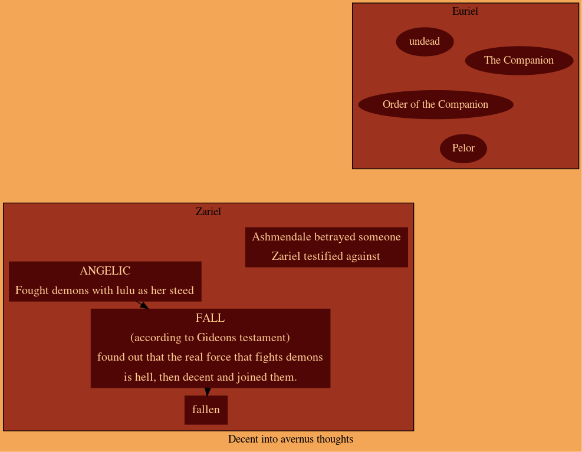

# Players and characters 

Lupus | Amber | Farris |  BlackSpirit | **WhiteBones** | BattleDerp
:--:|:--:|:--:|:--:|:--:|:--:
{.zoom .circle width=10em height=10em} | {.zoom .circle width=10em height=10em} | {.zoom .circle width=10em height=10em} | {.zoom .circle width=10em height=10em} | {.zoom .circle width=10em height=10em} | {.zoom .circle width=10em height=10em}

# World {.old .tabset .tabset-fade .tabset-pills}


# Characters {.tabset .tabset-fade .tabset-pills .old }
## Lulu the Hollyohant {.tabset .tabset-pills}

{width=75% .threeQuartersSize}

### Personality

#### Traits {.threeQuartersSize .book .cardOnHover .centered-text}

Nothing can shake my optimistic attitude.

Curious

Dreamy

Impulsive

***

Peace and Prosperity 
Greater Good. My gifts are meant to be shared with all, not used for my own benefit. (Good)

***

I would do what I could to help People be ok

***

I would trust my friends enough to follow them off a cliff

Actions speak louder than words

 
### Backstory

After being rescued from devils by the Kaelian mage Sylvira Savikas. Sylvira took it upon herself to recovery Lulu's memories while searching for a means to unlock a puzzlebox that came into her possession. A venture that has taken them from Kaelia to Port Solyma and if they weren't interrupted they would have gone to Euriel afterward. How Lulu might communicate this information to the rest of the party:

“I don’t remember…” “I don’t remember…” “I’m sorry, I don’t remember, Sylvira says something broke my head and it makes everything really confusing…” sad toot
“I came here, to Port Solyma with my friend Sylvira Savikas. She rescued me from a really mean ice devil.”
“Sylvira is really nice lady with pretty red skin and nice horns and a cute tail that she doesn’t like to show off. Oh! And she’s also a very good mage with a talking head for a spellbook.” Lulu nods wisely with a happy toot at the memory.
“Sylvira was helping me recover my memories and looking for a way to open a puzzlebox she has, so we came to Mercia from her tower in Kaelia and…” Lulu stops talking and looks down sadly
“Umm, ye… We followed them down into the catacombs and then and then they attacked us. They hurt Sylvira and she told me to run an-and I ran and ran and I got lost in the tunnels until I found another way out and there was a shrine and it was so green and then they saw me when I came out the ground and chase me and then I found you.” The little elephant-like creatures pace around in circles and collapse around themselves like a ball of golden fur

Lulu only has a few fragmentary memories of the time before her amnesia:

- Flying over a vast, dark ocean. The water reflecting a sky filled with diamond-like stars. In the black depths below, a huge whale seemingly made from golden motes of light swims through the darkness.
- Looking out a window made from gems set into silver and gold, across a verdant landscape where metallic dragons flit through the sky.
- The smiling face of a blindfolded golden-haired woman with ivory wings. A friend she doesn't remember.
- Flying over a boundless expanse of black, cracked basalt. A single-file line of strange, polyhedral-shaped creatures marches below, stretching from horizon to horizon.
- A busy marketplace carved from a cliff-face. She was speaking to a winged lion with the kind-yet-stern face of a man.
- Marching with an army of knights through a desolate wasteland against an army of monsters.
- Sometimes this feels like a magician’s trick: She remembers riding through a crimson portal, seeing a blasted plain stretched out in front of her, and then… Everyone is gone and she’s all alone.
- A silver beach beneath a pair of blue moons. Sometimes she remembers her warrior angel being with her there.
- The taste of blood and fur in her mouth.


# Notes {.tabset .tabset-fade .tabset-pills }

## flashbacks

### a

Ariel riding atop Lulu, her war elephant, were on a green grass, infront of us is a similar fleshy growth "hell portal'. 
Zariel calls out to someone to into the portal, Lulu felt she couldn't look away from it almost in a trance. 
Zariel shouts mentioning a name Lulu could not recall, "...he has taken one of our own! charge into the portal and him him back!" 
we all charge into the portal... memory ends.

### b

A Demonic knight of Palor called her name for a boon

### C

Zariel's testifying... she's screaming... someone's on trial... "your betrayal, Ashmendale, will cost!... i will speak my truth!"

## Gideons testement {.book}

> The overwhelming theme of the book regards the evils of demons:

The Woman: Tell me, O Master, of what is the greatest evil.  
Gideon: It is that of the Abyss. It is the teemless horde of chaos which seeks to rip down civilization.  
The Woman: And why should civilization be not destroyed?  
Gideon: Civilization is that which gives life meaning. It is the font of morality and thought. Of art and of science.

> Great praises are heaped upon those divinities which stand stalwart against this demonic threat:

It is the gods’ place to stand between Man and Chaos. It is their aegis which is their ultimate purpose, for behind their shield we create greatness and dedicate it to their honor.

> One night, however, Gideon awakens from a strange and formless dream and sees a disturbing vision in his bedchamber:

There I beheld her. Her beauty was so great it seemed to burn my eyes. And yet through my blindness I could see her with greater clarity than any other sight that I have ever beheld.  
Two great wings of white she had. And a sword of celestial steel so sharp that I could hear the hum of its edge. A weapon made to cleave the division between soul and mind.  
But then I saw this essence of perfection cast away her sword. Her wings turned black. Her eyes turned to pits of fire. And a great and terrible purpose furrowed her brow.

> The next day he speaks with the Woman in White, who tells him that she, too, has had a vision of this angelic being, and that its name is Zariel.

Gideon: But why should she have turned from the light?  
The Woman: She turned from the light because it blinded her.  
Gideon: Does not the light let us see?  
The Woman: That is the lie of the light. We think only of what it illuminates, but not of what it conceals from us.

> Gideon realizes that the Great Blindness – the Great Lie — is that the gods protect man from chaos:

… but it is not so! Pelor? Selune? Bahamut? Kord? His children? None of them battle the Abyss. They claim the glory of that war, but shed no blood in it!  
This is why Zariel turned from Heaven. She saw the truth of her holy purpose; the Great Need to stand against Chaos. And she saw that her “holy” power was powerless because her gods had willed it so. Thus she allied herself with Hell! For it is Hell who fights chaos! It is Hell which sacrifices itself in the Blood War! Hell which fights eternal so that we poor mortals may eke out a few years of freedom upon the mortal plane!

> Zariel is, thus, the inordinate exemplar of both sacrifice and surface. Gideon has nothing but praise for her, for the choice she made, and for the great work which she does in the service not only of the mortal races, but for the balance of the entire multiverse.

Without her, all would become Chaos. And all those who do not stand with her are servants and abettors of Chaos, though they know it not.

## Session notes {.tabset .tabset-fade .tabset-pills}

```{bash include = FALSE}
dot -Tpng ../Hugal/Avernus.gv -o ../Hugal/Avernus.png
```


### 1st back

City- Euriel

Gideon- plans to make army of undead to free euriel. Forgot who Pelor was.

devil- the philosopher, winged on the house. 
ah, they institutionized a religious subversion, instead of venerating gods, venerating a religious idol.

Mage tower, overrun by hell knights

Curriors tower/guild
filled with dead people

basement lvl 1

Doors, light, organic matter and rubble
singular head with a helmet on the floor

something moving in the back

vent -> boiler room -> spherical pods on the wall from a strange and horrid fiend. One which ripped countless people into shreds onto the walls.

Noelle, Alistair's sister, crippled from the lower body but managed to survive.


### 2nd back

We go towards High Hall.

Noelle disgruntled rides on the white sun

Her majesty's peacekeepers, carrying barrels of water and food.

Dracanoid individual, white in color. NE -> SW


in helm

angel with red eyes

tall devil in black and gold, two long dark horns, he reaches over to her, "where is her sword?"


we are all uniformed in a knights garb,
woman with dark hair, bearded man, the angel riding a mammoth (lulu)    

Haruman, Lord Knight of the Far Hills greets Lord Olanthius
lady yale of Idyllglen

avernus (battle in distance)
Zariel kneeling in the dust, Yale as well

Zariel is pushing her sword to Yale's hand. "I refuse, do not ask me of this" Zariel: "I must, please do look beyond this forsaken day, dream a little bigger." With a trumpet, lulu comes Charging forth, "I've driven them off fora little bit" "Lulu my dear friend protect yale and don't let her sword fall. We may never meet again, but i hope we do. This is the last thing I will ever ask of you. Protect yale"

Vision clears, "riding on full horseback towards battle." ahead of  us on a golden mammoth, Zariel. (mostly human knights against knolls)

12 ft gnoll leaps through a portal with lady yale in her hand.


"Where is the sword"

"I dont know... I... I.. Used to know but i don't any more... I don't... I don't..."

An immense circular light overtakes the portal, a soothing light shilluetteing a figure. It's deep voice booming "To Lulu ye Zariels blade, it's key to her heart and what she desires. Even from my sight is the sword hidden, the only one who knows knows not. She must seek the kenku, in her memory they speak. Seek the kenku!"

Mr Bennersby  was making a deal with an imp
casted suggestion to make the imp tell the halfling of his evil plans for his soul and his families.
Mr Bennersby joined our safe house.

#### Creed Resolute. 

The founding document for the Order of the Companion of which each knight carries an abridged version. The full Creed is actually a lengthy document proscribing and prescribing various courses of action that are “right and proper” for a knight. This includes some guidance that’s ethical and moral (chivalric code), as well as other guidance that’s more practical such as codes of dress and the list of arms and armour which any follower of the Creed must maintain. Also contained within is the oath the knights swear to uphold the Creed:
I solemnly pledge my soul and blood and blade to serve as a knight of Euriel and share the Oath of the High Observer in honouring the Gift of the Companion. I shall guard the realm of Mercia and all those lands which lie under Euriel’s Shield, upholding the laws of Mercia and the commands of the High Observer. I shall live my life in strict accord to the Creed Resolute, placing it and this oath above all other doctrines. I shall be bound to all others who swear this oath, declaring them now and forevermore, whether in life or beyond the veil of death, to be my brothers in arms. To ensure the perfect harmony of our brotherhood, I shall permit no difference in faith to come between us, but rather hold the Companion, which I shall never attribute to one god or another, as our common star.

### 3

We set off to look for kenkus.

Magnar used to have a kenku friend.

We decended with a rope down a cliff, engraved:
night of the red coup 1291 af

We see a man running from 3 goatlike devils, 
after saving him, we make his aqaintance.

> Orin Ragron, a blacksmith of Euriel. 


5 hell knights on  bahamut blessed (trapped) bridge
2 with wings
1 large 
2 normal

Master of cruelties (his liege Arthur) knows Alistair. A high knight.

After many difficulties we killed them and had a rest.
Lulu opened the Infernal puzzlebox.


Travelled accross the brifge to the Pastry shop, where a wizard and his children hid.

> Bulmor, the human proprietor and school of pastries wizard. His two older daughters Tevra and Maribe are with him

#### Infernal contract {.book .threeQuartersSize}

On this, the 29th day of Silval, in the one thousandth, three hundredth, and forty-first year of the Sygaxian Callender, I, Naja Bellandi, by my authority as the High Watcher of Palor and the highest surviving mortal authority in the city of Euriel , do swear this Oath to pledge my soul and the entire city of Euriel unto the Archduchess Zariel, to be so passed into her custody at the end of fifty years, the latter to be transported to Avernus and the former to be taken into her service.

In exchange for which, Zariel, the Archduchess of Avernus and faithful representative of Asmodeus, the Archfiend, Lord of the Ninth and Nessus, Supreme Master of the Nine Hells, bestows the Gift of the Companion, a Solar Insidiator which shall be placed in the sky above Euriel for at least the term of this agreement and whose light will scourge the undead from the city. She further swears to render whatever aid may be necessary to end High Rider Klav Ikaia’s reign if the Gift of the Companion prove insufficient to this task.

In consideration and honor of these mutual covenants, we sign in blood upon the day and year first written above.

Zariel, Archduchess of Avernus.

High Watcher Naja Bellandi of Euriel.