# Players and characters 

Lupus | Amber | Farris |  BlackSpirit | **WhiteBones** | BattleDerp
:--:|:--:|:--:|:--:|:--:|:--:
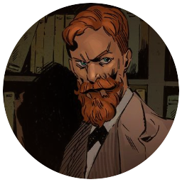 | 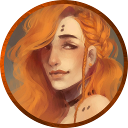 |  | 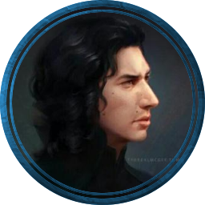 | 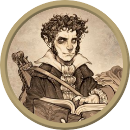 | 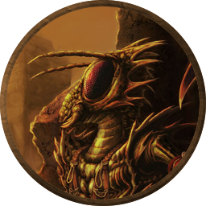
Nox Kieron | Alistina Goldengrain | Ulgrimm Abersham | Trent Thundersinger | **GOD** | Rak-Tak
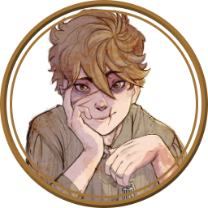 | 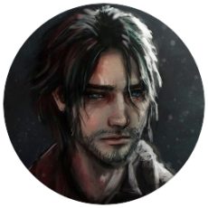 | 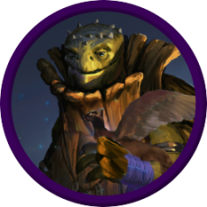 |  | - | -
Nathaniel Dalton | Vai Lovari |Salihafa Salkud Sully | Eric Fairhand | - |- 
 - | 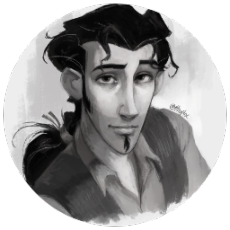  | 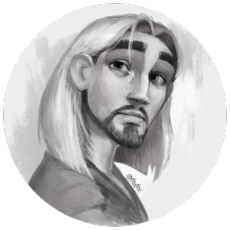 | - | - |-
 - | Tulio | Miguel  | - | - | -
 -| 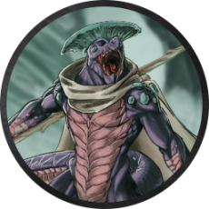 | - | - | - | -
 -| Tik'ra | - | - | - | -

# World {.old .tabset .tabset-fade .tabset-pills}

## Capital of Cyn

### Trollskull Alley {.tabset .tabset-fade .tabset-pills}
A quaint alley lies in the upper middle class part of cyn city.

Places | People
:-:|:---
Trollskull Manor | The ghost **Ife** and the **Elements of surprise**
The Bent Nail | 'Tally' the half elf
Steam and Steel | Two Genasi husbands **Avi**(water) and **Embric**(fire)
Correlon's Crown | Fila L'faire (elf)
Tiger's eye | 'Vincent'
Zephyr post | Dexter
Silent Shield | Alfogheak Strongchest

## Doom Raiders {.tabset .tabset-fade .tabset-pills}

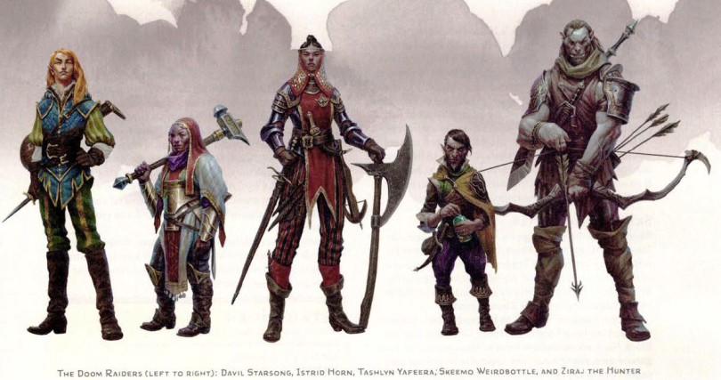{ .halfSize width=50%}

### Davil Starsong {}

#### 

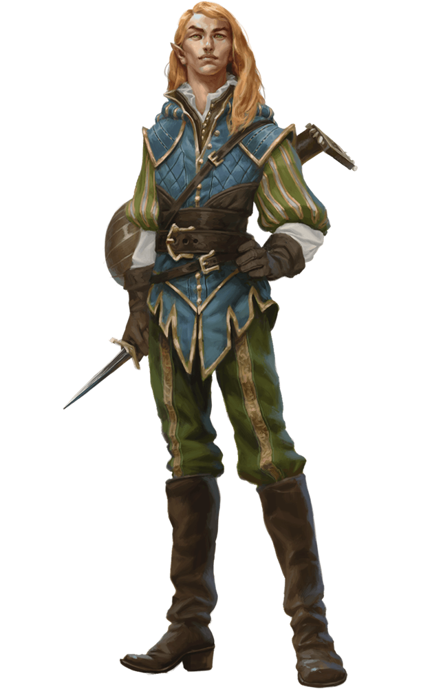{.book .token .halfSize width=50% }

### Istrid Horn

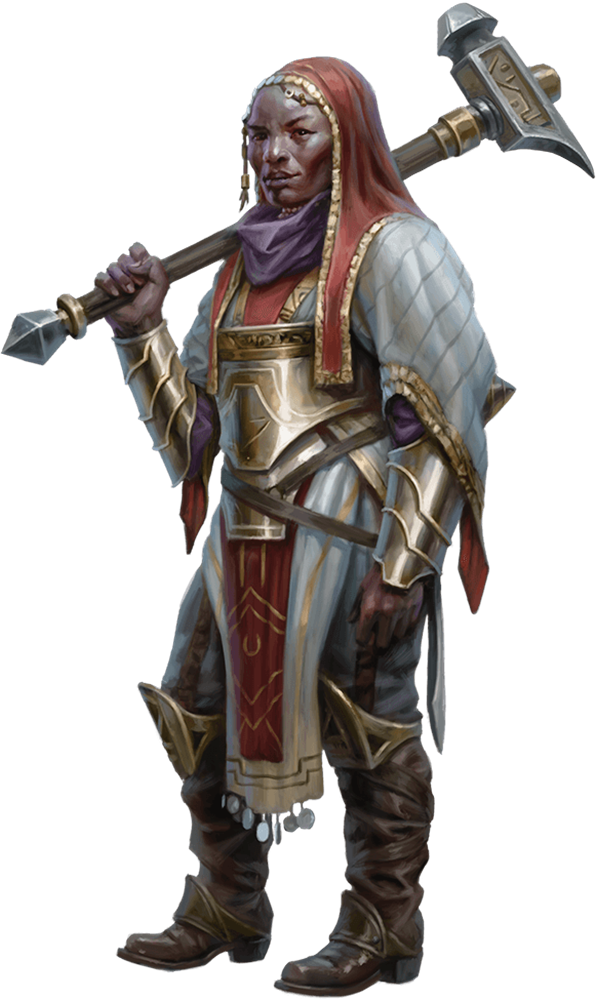{.book .token .halfSize width=50% }

### Tashlin Yafera

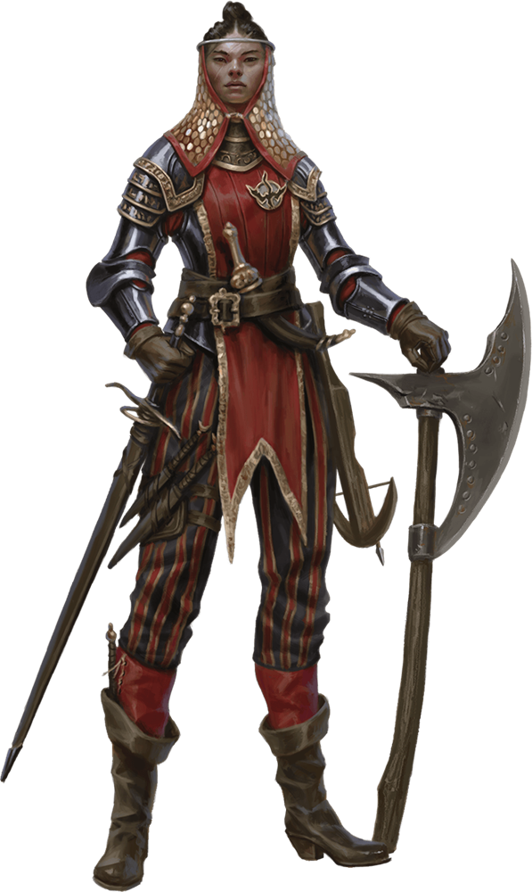{.book .token .halfSize width=50% }

### Skeemo Weirdbottle

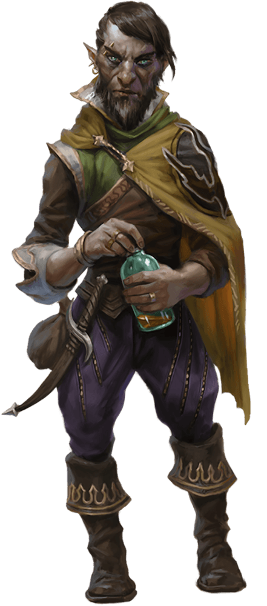{.book .token .halfSize width=50% }

### Ziraj the hunter

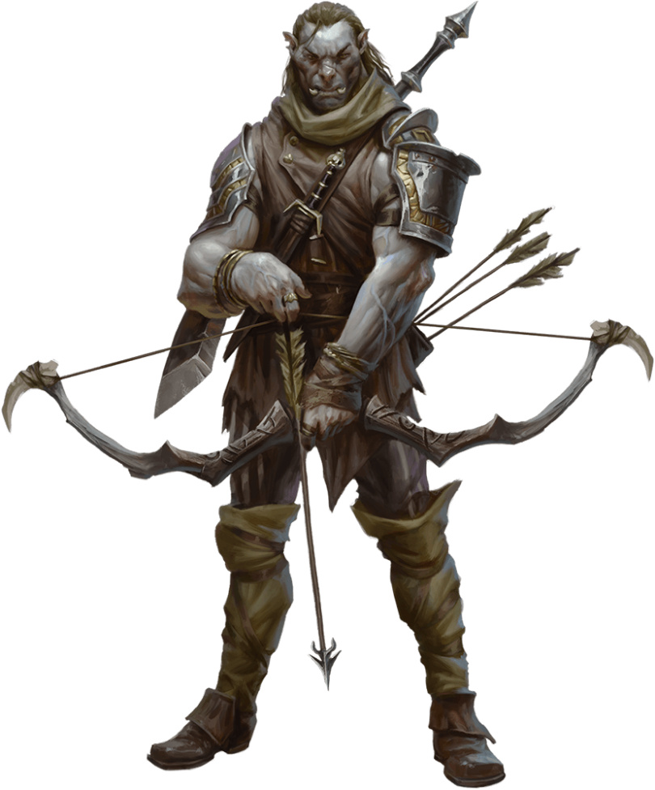{.book .token .halfSize width=50% }

## The black king

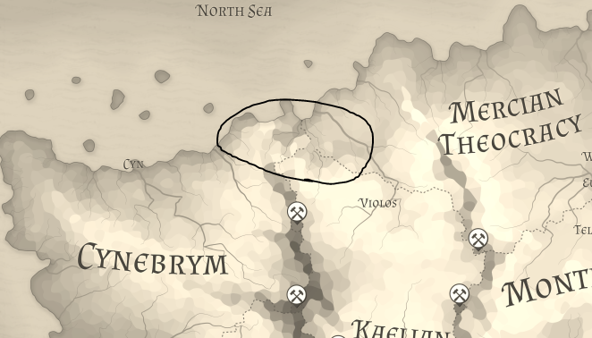{ }

# Characters {.tabset .tabset-fade .tabset-pills .old }

## Nox {.tabset .tabset-fade .tabset-pills}

### Bio

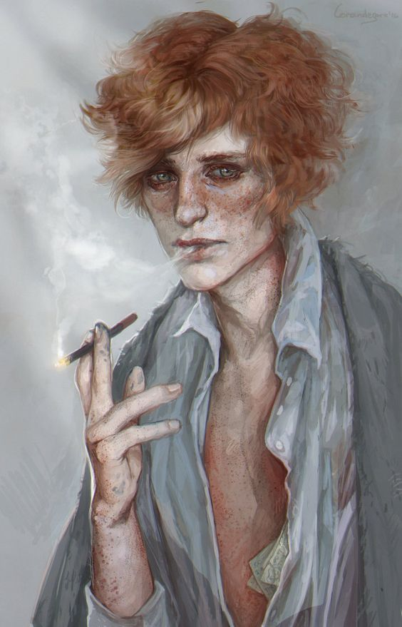{width=33.3% .zoom}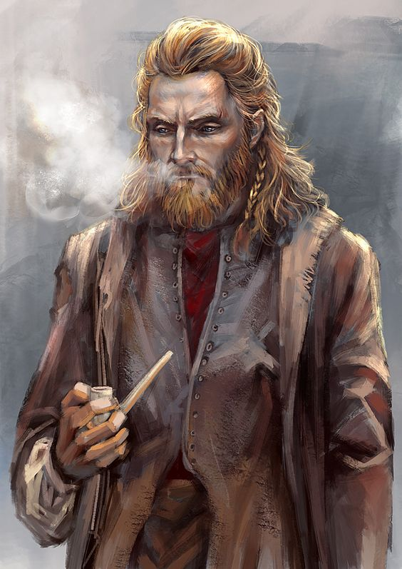{width=33.3% .zoom}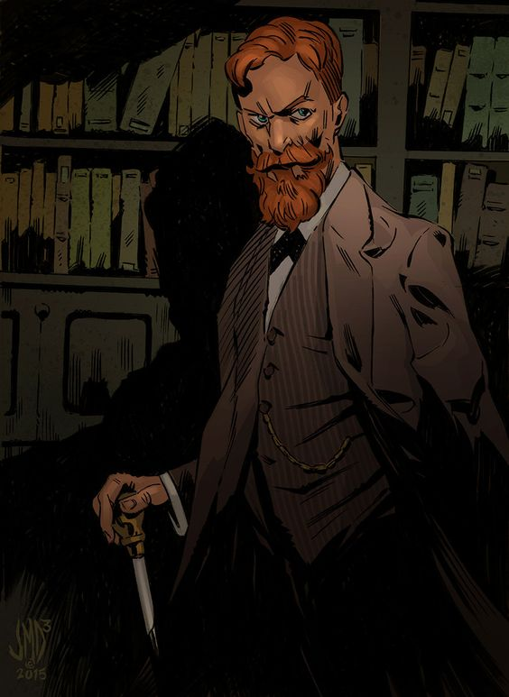{width=33.3% .zoom}

### Backstory 

#### Home

Nox Kieron was was born to an ordinary home in the south of Sage coast to a Domnall and Ciara Kieron. Being an only child he found much company in books and people older than him. Though always interested in magic, he surprised not only others but also himself when he first cast a cantrip taught to him by a family friend. Prestidigitaion, of course. A year or two and tugging on family connections later: Nox had learned a bit more magic and accepted to the Sygaxian college.

#### College life {.justify }

##### Overview {.halfSizeLeft .book .cardOnHover}
Nox's time in the Sygaxian college was influenced by a few key factors:  

* Nox's curiosity and strife to learn, combined with his diligence.  
* Professor Radaghast being an aloof, if not uncaring, mentor.  
* The welcoming nature of Nox's roommate and then partner of sorts, Flynn.  
* The group of students that Nox hung out with being party animals of varying degrees.  
* Rumors of a strange book in the forbidden parts of Radaghast’s archives.  

##### A stranger in a strange land  

Nox joined the Academy at an early-ish age, at least one unusual to see at the arcane academia section of the college. It would've been hard for him to make friends, if the dorms had not been shared between all of the sections. It was this lucky detail that led Nox to meet some of the more friendly people in that college. In the first few months, Nox was alone in his dorm however. He believed it unnecessary to try and socialize too much, he was here for a reason after all, to study the arcane. This he did, successfully and with a diligence hard to find in people his age.

##### An uncaring teacher  

With time Nox noticed Radaghast's apathy to the new addition to his archive. Giving Nox work, sure, but only one seemingly unending mind numming task after another. Be it Copying a book, scroll, rearranging the books by category in the archive or any other menial task someone with half a brain could do. With this, Nox's focus shifted more on his  own studies and curiosities. When he had chances he would read the books there and investigate the other held items. This was certainly a lot more fulfilling than and he grew in his comprehension over the arcane.

##### And they were roommates   

After a few months, Nox was transferred to another room in the dorms. He was a bit nervous to say the least. A pleasant surprise, Nox thought as the man who opened the door did so with a welcoming smile. He looked only a year or two older than Nox, with shoulder length black hair, a genuine smile formed with the whole face and what seemed to be a lingering whiff of tobacco. As if finding the student at his door entertaining, the man invited Nox in, introducing himself as Flynn Smith. The two hit off immediately, Flynn finding the younger man entertaining in his shyness and uniqueness. Nox finding the other comforting, both in Flynn having been in the academy for years and his warm and welcoming personality with Nox felt he could rely on. As time showed, they could rely on each-other. Till Nox left in a few years, they were an inseparable pair. 

##### Parties and People  

As Nox found out, Flynn was part of the lusciously lively underbelly, that was the partyscape, of the less dry academia sections of the Sygaxian college. Now that they were spending the time together, Nox was slowly becoming pulled in, not that he didn't want to. Nox did not go overboard with either the parties or substances that were now available to him, resilient and reasonable, he had considered himself back then. The time spent among people and Flynn in particular had become his source of comfort in what was an otherwise uneventful time in college. This way of life lasted for a long time.

##### Books and Breaking points  

Time flew by and Nox found himself grow in many ways, his arcane studies providing him a clear goal, his emotional life blossoming in a way it simply had never before and his increasing mutual apathy to Professor Radaghast. Slowly but surely, Nox was getting closer to both an impasse in his private studies and a reluctance comply with Radaghast's moronic decisions. He knew *of* the forbidden section in the archives of course, though had never been inside. After a long time studying, reading and rereading the tomes in the archive, though nothing there was enough to get the largely self taught Nox to break through to the second tier in his castings. In this state of frustration, trying to unwind in a party where a certain rumor reached his ears. There was a tome in the forbidden section, one which could empart an understanding of the arcane deeper than any study. Or so it went. That was when Nox made up his mind, he would sneak into the forbidden section, do his research and leave. If there was anyone who knew how it was Nox. Confiding in Flynn, nox slept better that night than many before or any since.

##### Birth of a magnificent dumpsterfire  

The day after, Nox, on his usual rounds doing research in the archives, took a detour. He navigated through the back and into the forbidden section. He had seen Radighast come to and fro a few times and he was confident he could get in. He did, entering a room with books from ceiling to floor, all looked interesting, but only one sent a creeping chill down his spine. One of the few books on a pedestal, with a translucent covering dome keeping it from the stale but carefully managed air. Carefully making sure there were no wards, Nox removed the dome, revealing the book in its full glory. The mere sight of it made it feel like the air was charged with a tense energy. The following hours were a blur of a vision, voice. He stared the book and began frantically searching his mind for something that might explain this experience. The whispers and utterances once incomprehensible, now becoming clearer and the realization of what he had learnt, now arriving. Everything is in danger, and has been since age immamorium. Visions, horrors ravishing the earth and whispers screaming in his mind. A ring of keys landed on the book from an unseen place. He managed to close the lid and return, somehow unnoticed, the Keys in hand. 

##### A confusing muddle of clarity 

Nox was... changed, like a glass orb cracking under pressure, yet not shattering. The newlyformed cracks guiding the passing light in a peculiar, clearly structured yet hopelessly chaotic way. He could get no sleep that night, his thoughts chaotic, malformed, yet with a strange pattern of clarity on the structure of arcana. It had been hard to find peace in the thoughts of his mind. What followed was a drug indulged time, Worried faces of Flynn, worried for Nox's safety, drug use and strange newfound obsession with darker tones of magic. Nox tried his best to remain unchanged at least in Flynns eyes, but his eyes had betrayed a deep scar in his psyche. In a short time, Nox had discarded Radaghast’s work almost complately. Due to its nature it was still a while before Radaghast noticed. In the meantime, nox had understood and cast his first, second and third 2. tier spell. 
He knew it now, this place had knowledge sure, but it was still out there, the thing in the whispters and visions. He learnt what he could, spent some time with Flynn again, seems like the leasurely certainness that Nox had now, eased his thoughts. Once Nox recieved a message, that Radaghast was throwing him out, Nox bid his farewell and left unceremoniously. 

### Three questions

## Lulu the Hollyohant {.tabset .tabset-pills}

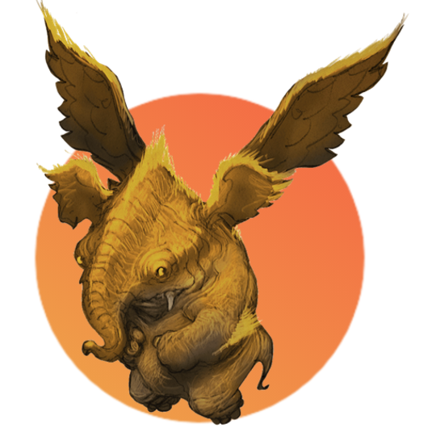{width=75% .threeQuartersSize}

### Personality

#### Traits {.threeQuartersSize .book .cardOnHover .centered-text}

Nothing can shake my optimistic attitude.

Curious

Dreamy

Impulsive

***

Peace and Prosperity 
Greater Good. My gifts are meant to be shared with all, not used for my own benefit. (Good)

***

I would do what I could to help Sylvira be ok

***

I would trust Sylvira enough to follow her off a cliff

Actions speak louder than words

#### Test 
### Backstory

# Misc notes into top

Wyllow of the Wyllowwood, tell her he's sorry and she needs to let him go, Yinark.

dwemarcore at lvl 9

## Dungeon of mad mage

Rizzle

### Level 4

Mind altering magic, Mind flayers?

Looking for the alchemist up north.

  

